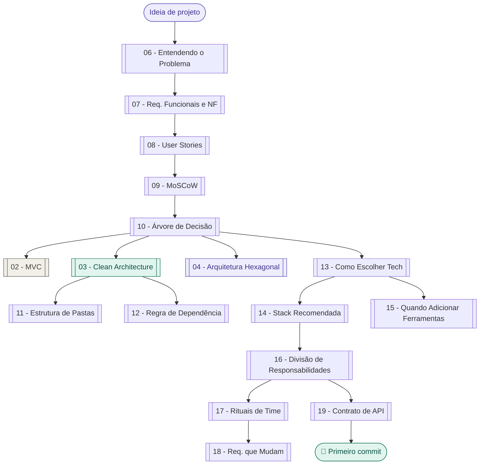
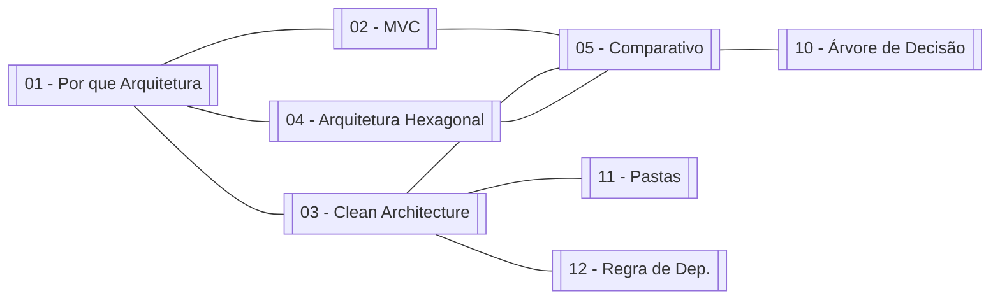
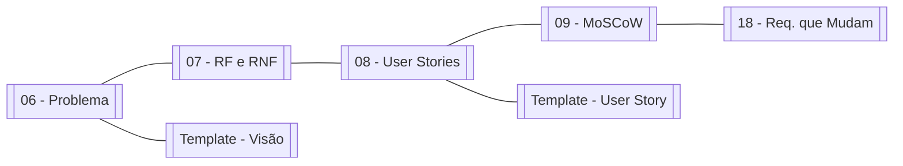
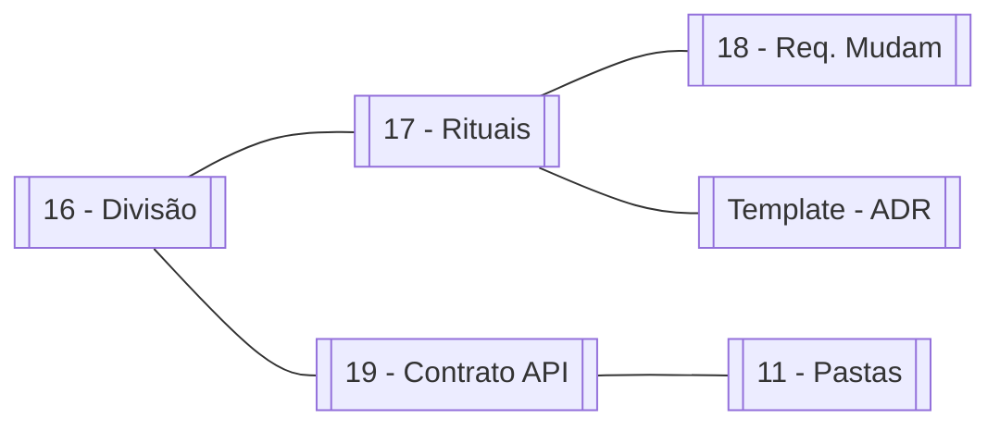

# 🔗 Mapa de Conexões — Grafo do Vault

tags: #moc #grafo
links: [[🗺️ Mapa Principal]]

---

> Esta nota existe para criar conexões explícitas entre todas as notas do vault.
> O Obsidian Graph View vai mostrar o grafo completo ao abrir esta nota.

---

## Fluxo principal (da ideia ao código)

---

## Mapa temático — Arquitetura

---

## Mapa temático — Requisitos

---

## Mapa temático — Time e processo

---

## Links para todos os nós (para o grafo do Obsidian)

[[01 - Por que Arquitetura Existe]]
[[02 - MVC]]
[[03 - Clean Architecture]]
[[04 - Arquitetura Hexagonal]]
[[05 - Comparativo de Arquiteturas]]
[[06 - Entendendo o Problema]]
[[07 - Requisitos Funcionais e Não-Funcionais]]
[[08 - User Stories]]
[[09 - Priorização com MoSCoW]]
[[10 - Árvore de Decisão de Arquitetura]]
[[11 - Estrutura de Pastas Clean Architecture]]
[[12 - Regra de Dependência]]
[[13 - Como Escolher Tecnologias]]
[[14 - Stack Recomendada para Projetos Acadêmicos]]
[[15 - Quando Adicionar Ferramentas]]
[[16 - Divisão de Responsabilidades]]
[[17 - Rituais de Time]]
[[18 - Lidando com Requisitos que Mudam]]
[[19 - Contrato de API]]
[[Template - Documento de Visão]]
[[Template - User Story]]
[[Template - Decisão de Arquitetura]]
