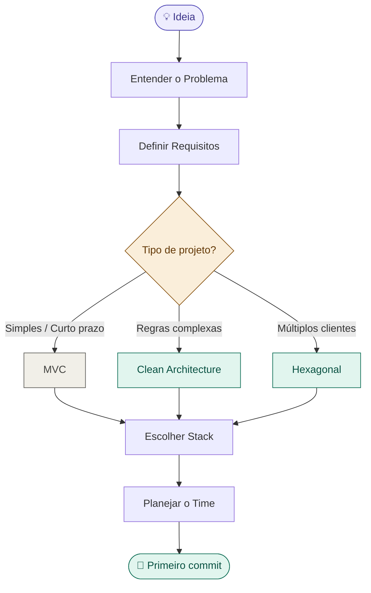
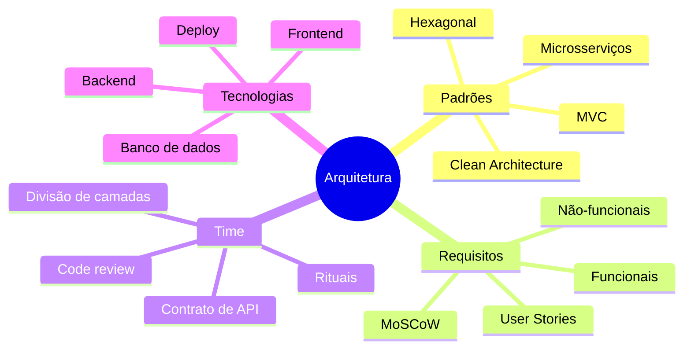

# 🗺️ Mapa Principal — Arquitetura de Software

> Vault de estudo para coordenadores de projetos acadêmicos.
> Siga o fluxo numerado ou navegue pelos mapas temáticos.

---

## Fluxo do processo completo

---

## Índice de notas

### Fundamentos
- [[01 - Por que Arquitetura Existe]]
- [[02 - MVC]]
- [[03 - Clean Architecture]]
- [[04 - Arquitetura Hexagonal]]
- [[05 - Comparativo de Arquiteturas]]

### Requisitos
- [[06 - Entendendo o Problema]]
- [[07 - Requisitos Funcionais e Não-Funcionais]]
- [[08 - User Stories]]
- [[09 - Priorização com MoSCoW]]

### Arquitetura
- [[10 - Árvore de Decisão de Arquitetura]]
- [[11 - Estrutura de Pastas Clean Architecture]]
- [[12 - Regra de Dependência]]

### Tecnologias
- [[13 - Como Escolher Tecnologias]]
- [[14 - Stack Recomendada para Projetos Acadêmicos]]
- [[15 - Quando Adicionar Ferramentas]]

### Time
- [[16 - Divisão de Responsabilidades]]
- [[17 - Rituais de Time]]
- [[18 - Lidando com Requisitos que Mudam]]
- [[19 - Contrato de API]]

### Templates
- [[Template - Documento de Visão]]
- [[Template - User Story]]
- [[Template - Decisão de Arquitetura]]

---

## Mapa de conceitos relacionados

