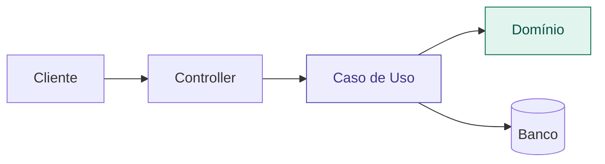

# 01 — Por que Arquitetura Existe

tags: #fundamentos #arquitetura
links: [[02 - MVC]] | [[🗺️ Mapa Principal]]

---

## Definição simples

Arquitetura de software é a arte de **controlar quem fala com quem** — e por qual caminho.

É o conjunto de decisões estruturais que definem como um sistema é organizado, quais componentes existem e como eles se comunicam.

---

## O problema que ela resolve

Sem arquitetura, sistemas viram uma bola de lama (*Big Ball of Mud*):

```
Frontend ←→ Banco de dados
Frontend ←→ E-mail service
Frontend ←→ Auth
API ←→ Banco de dados
API ←→ Frontend
Auth ←→ E-mail service
...
```

**Consequências práticas:**
- Mudar qualquer parte quebra outras partes inesperadamente
- Testar uma funcionalidade exige subir o sistema inteiro
- Onboarding de pessoas novas é doloroso
- Bugs aparecem em lugares sem relação com a mudança feita

---

## Como a arquitetura resolve isso



Cada seta tem uma direção clara. Cada camada tem uma responsabilidade única.

---

## Quando a arquitetura importa mais

| Situação | Impacto da arquitetura |
|---|---|
| Projeto de 1 semana | Baixo — qualquer coisa funciona |
| Projeto de 3+ meses | Alto — decisões iniciais custam caro depois |
| Time de 3+ pessoas | Alto — conflitos de código e responsabilidade |
| Sistema com testes | Muito alto — arquitetura ruim torna testes impossíveis |

---

## Próximas notas
- [[02 - MVC]] — o ponto de entrada
- [[03 - Clean Architecture]] — o salto de maturidade
