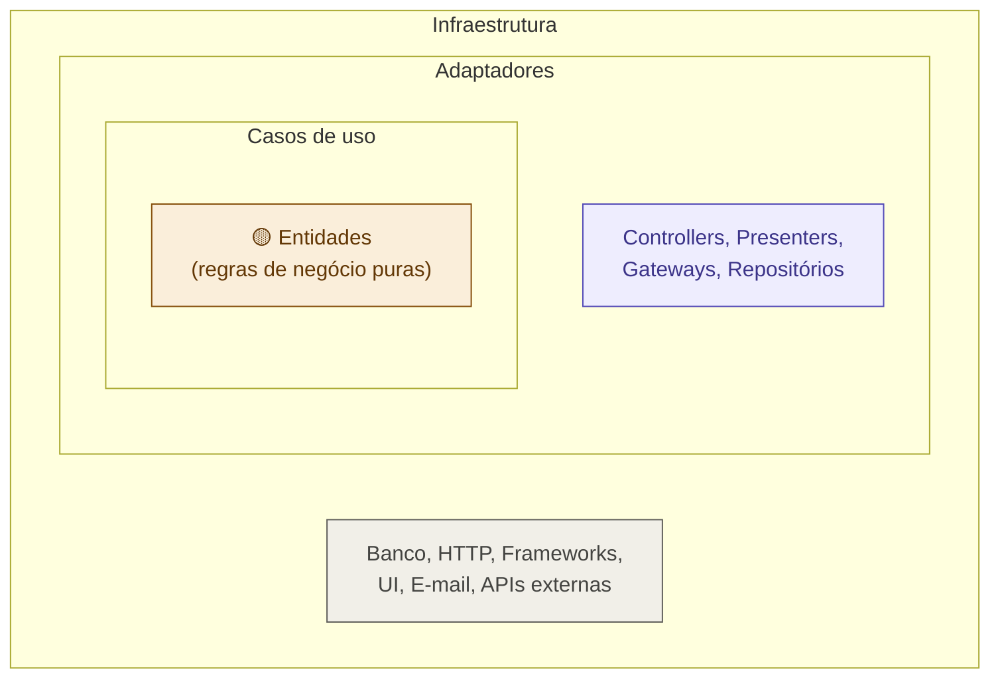

# 03 — Clean Architecture

tags: #fundamentos #arquitetura #clean
links: [[02 - MVC]] | [[04 - Arquitetura Hexagonal]] | [[11 - Estrutura de Pastas Clean Architecture]] | [[12 - Regra de Dependência]]

---

## O que é

Clean Architecture (Robert C. Martin, 2012) organiza o sistema em **camadas concêntricas**, onde as dependências só apontam para dentro — o núcleo nunca conhece nada externo.

> "O negócio não sabe que existe um banco de dados."

---

## As camadas



| Camada | O que contém | Pode depender de |
|---|---|---|
| **Entidades** | Regras de negócio puras | Nada |
| **Casos de uso** | Regras da aplicação | Entidades |
| **Adaptadores** | Controllers, Repositórios | Casos de uso |
| **Infraestrutura** | Banco, HTTP, Frameworks | Adaptadores |

---

## A regra de dependência

```
Infraestrutura → Adaptadores → Casos de Uso → Entidades
```

**Nunca ao contrário.** Uma Entidade jamais importa algo de Infraestrutura.

Veja mais em [[12 - Regra de Dependência]].

---

## Exemplo prático

```typescript
// ENTIDADE — não sabe nada do mundo externo
class User {
  constructor(
    private email: string,
    private name: string
  ) {
    if (!email.includes('@')) throw new Error('E-mail inválido')
  }
}

// INTERFACE DO REPOSITÓRIO (contrato) — ainda no domínio
interface IUserRepository {
  save(user: User): Promise<void>
  findByEmail(email: string): Promise<User | null>
}

// CASO DE USO — usa o contrato, não a implementação
class CreateUser {
  constructor(private repo: IUserRepository) {}

  async execute(email: string, name: string) {
    const exists = await this.repo.findByEmail(email)
    if (exists) throw new Error('Usuário já existe')
    const user = new User(email, name)
    await this.repo.save(user)
  }
}

// REPOSITÓRIO CONCRETO — na infraestrutura
class UserRepositoryPG implements IUserRepository {
  async save(user: User) {
    await db.query('INSERT INTO users ...')
  }
  async findByEmail(email: string) {
    return db.query('SELECT * FROM users WHERE email = $1', [email])
  }
}
```

---

## Quando usar

✅ **Use Clean Architecture quando:**
- Regras de negócio são complexas e precisam de testes unitários
- O sistema pode mudar de banco ou framework no futuro
- Time tem pelo menos alguma experiência com separação de responsabilidades
- Projeto com mais de 3 meses de duração

❌ **Evite quando:**
- MVP de 2 semanas — overhead não compensa
- Time nunca viu injeção de dependências antes
- Projeto descartável ou experimental

---

## Onde aparece no mercado

- Padrão em empresas com equipes de engenharia maduras
- Base de arquiteturas em sistemas financeiros, saúde, e-commerce robusto
- Muito usado com NestJS (Node.js) e Spring Boot (Java)

---

## Próximas notas
- [[11 - Estrutura de Pastas Clean Architecture]] — como organizar as pastas
- [[12 - Regra de Dependência]] — a regra mais importante
- [[04 - Arquitetura Hexagonal]] — prima da Clean
