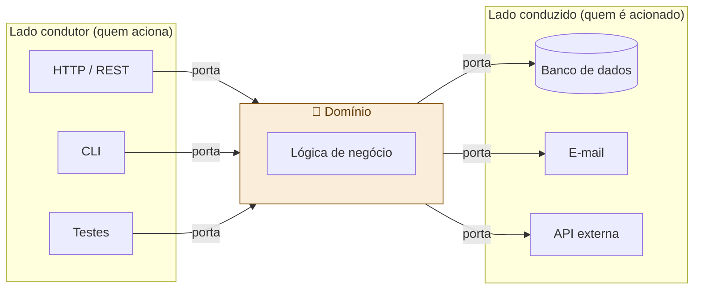

# 04 — Arquitetura Hexagonal

tags: #fundamentos #arquitetura #hexagonal
links: [[03 - Clean Architecture]] | [[05 - Comparativo de Arquiteturas]]

---

## O que é

Criada por Alistair Cockburn (2005). Também chamada de *Ports and Adapters*.

A ideia central: o domínio fica no centro, isolado. Tudo que é externo (banco, HTTP, CLI, testes) se conecta via **portas** (interfaces) e **adaptadores** (implementações).

---

## Como funciona

---

## Diferença para Clean Architecture

| | Clean Architecture | Hexagonal |
|---|---|---|
| **Foco** | Camadas concêntricas | Portas e adaptadores |
| **Visualização** | Círculos aninhados | Hexágono com plugues |
| **Granularidade** | Define 4 camadas explícitas | Define 2 lados (condutor / conduzido) |
| **Na prática** | Muito parecidas — mesma filosofia |

> A Clean Architecture é uma formalização mais detalhada da Hexagonal. Na prática do mercado, os termos são usados de forma intercambiável.

---

## Quando usar

Use Hexagonal quando o sistema precisa ser acionado por múltiplos clientes (HTTP, fila, CLI, testes) e/ou precisa trocar facilmente os serviços externos (banco, e-mail, pagamento).

---

## Próximas notas
- [[05 - Comparativo de Arquiteturas]]
- [[10 - Árvore de Decisão de Arquitetura]]
