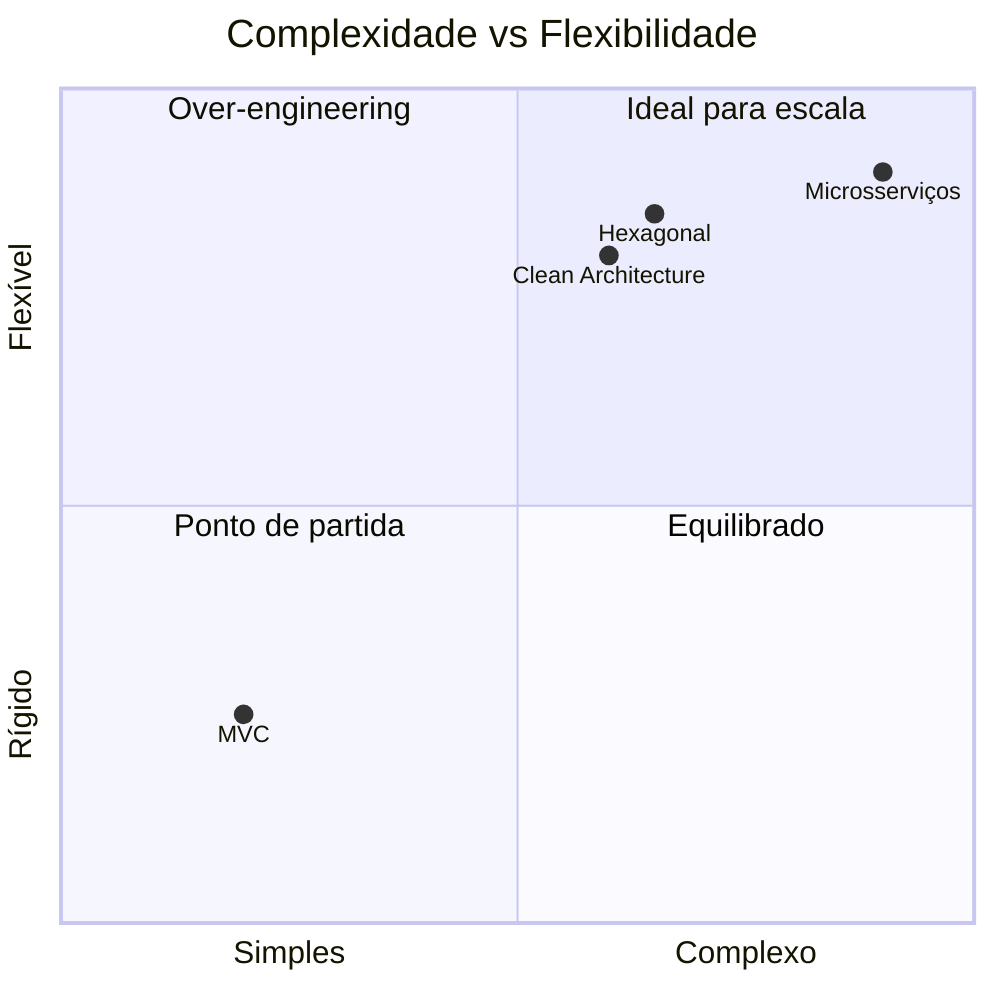
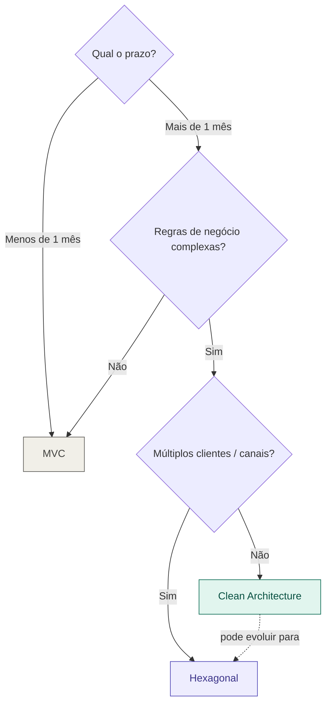

# 05 — Comparativo de Arquiteturas

tags: #fundamentos #arquitetura #comparativo
links: [[02 - MVC]] | [[03 - Clean Architecture]] | [[04 - Arquitetura Hexagonal]] | [[10 - Árvore de Decisão de Arquitetura]]

---

## Visão geral

---

## Tabela comparativa

| Critério | MVC | Clean Architecture | Hexagonal |
|---|---|---|---|
| **Curva de aprendizado** | Baixa | Média | Média |
| **Testabilidade** | Média | Alta | Alta |
| **Flexibilidade** | Baixa | Alta | Alta |
| **Overhead inicial** | Baixo | Médio | Médio |
| **Bom para** | MVPs, APIs simples | Sistemas com regras complexas | Sistemas com múltiplos clientes |
| **Frameworks** | Laravel, Django, Rails | NestJS, Spring | Qualquer um |

---

## Quando usar cada um

---

## Para projetos acadêmicos (2-4 pessoas)

| Duração | Recomendação |
|---|---|
| Até 4 semanas | MVC simples |
| 1-3 meses | MVC bem estruturado ou Clean Architecture leve |
| 3+ meses | Clean Architecture completa |

> **Regra prática:** nunca escolha uma arquitetura que você não consegue explicar para o time em 10 minutos. Arquitetura que só você entende é pior do que MVC simples.
