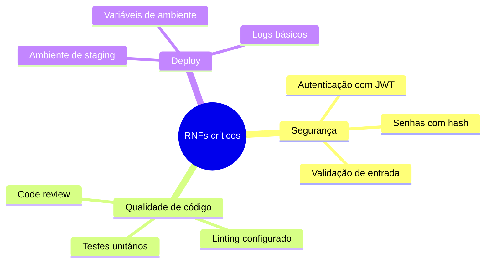

# 07 — Requisitos Funcionais e Não-Funcionais

tags: #requisitos
links: [[06 - Entendendo o Problema]] | [[08 - User Stories]] | [[09 - Priorização com MoSCoW]]

---

## Requisitos funcionais (RF)

O que o sistema **faz**. São as funcionalidades visíveis ao usuário.

**Formato:** "O sistema deve [verbo] [objeto]"

**Exemplos:**
- O sistema deve permitir cadastro de usuário com e-mail e senha
- O sistema deve enviar e-mail de confirmação após o cadastro
- O admin deve poder bloquear e desbloquear usuários
- O usuário deve poder redefinir sua senha via e-mail

---

## Requisitos não-funcionais (RNF)

Como o sistema **se comporta**. Qualidade, não funcionalidade.

| Categoria | Exemplos |
|---|---|
| **Performance** | Resposta em < 200ms para 95% das requisições |
| **Escalabilidade** | Suporta 500 usuários simultâneos |
| **Segurança** | Senhas com bcrypt, dados criptografados em repouso |
| **Disponibilidade** | 99.5% de uptime |
| **Manutenibilidade** | Cobertura de testes > 70% |
| **Usabilidade** | Interface funcional em mobile e desktop |

---

## RNFs mais importantes para projetos acadêmicos

---

## Erro comum: ignorar RNFs

Times iniciantes listam só requisitos funcionais. Os RNFs são combinados tarde, quando já é difícil mudar a arquitetura.

> Defina pelo menos os RNFs de segurança e qualidade de código no início do projeto.

---

## Próximas notas
- [[08 - User Stories]] — como escrever requisitos de forma acionável
- [[09 - Priorização com MoSCoW]]
