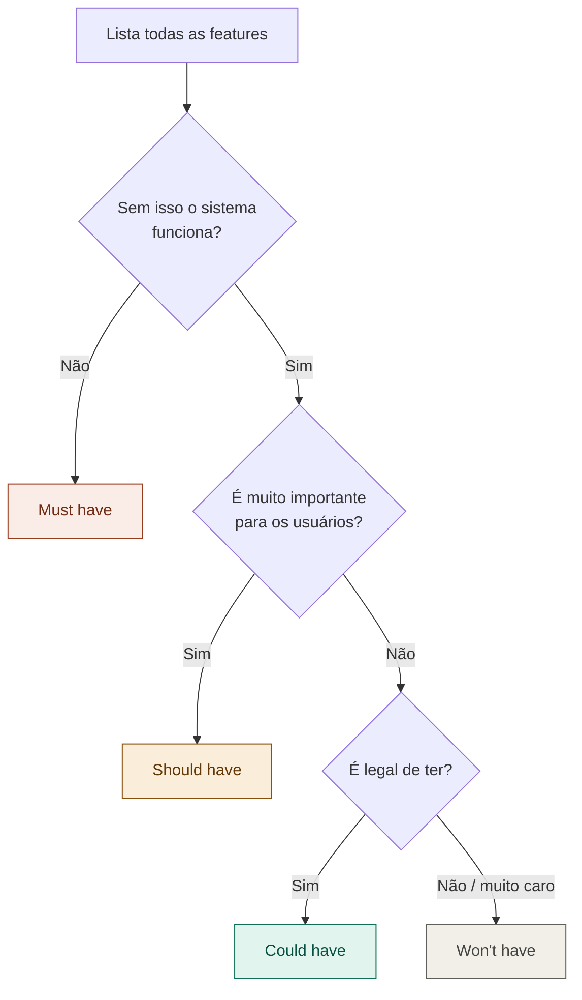

# 09 — Priorização com MoSCoW

tags: #requisitos #priorização
links: [[08 - User Stories]] | [[18 - Lidando com Requisitos que Mudam]]

---

## O que é

MoSCoW é um framework de priorização de requisitos. O nome é um acrônimo:

| Label | Significado | Tradução prática |
|---|---|---|
| **M**ust have | Obrigatório | Sem isso, o projeto não existe |
| **S**hould have | Importante | Deve entrar, mas não bloqueia o lançamento |
| **C**ould have | Desejável | Entra se sobrar tempo |
| **W**on't have | Fora do escopo | Explicitamente deixado para depois |

---

## Como aplicar na reunião do time

---

## Exemplo aplicado

Projeto: plataforma de estudos para a faculdade

| Feature | Classificação | Motivo |
|---|---|---|
| Login e cadastro | Must have | Sem autenticação não há plataforma |
| Criar e ver disciplinas | Must have | Funcionalidade core |
| Upload de arquivos | Should have | Importante, mas pode lançar sem |
| Notificações por e-mail | Could have | Agrega valor, não é bloqueante |
| App mobile | Won't have | Fora do escopo desta versão |
| Relatórios de desempenho | Won't have | Próxima versão |

---

## Regra prática

> Se tudo é Must Have, nada é prioridade. Force o time a colocar pelo menos 40% das features como Should ou Could.

O MoSCoW também serve como ferramenta de negociação quando surgem novos requisitos no meio do projeto. Veja [[18 - Lidando com Requisitos que Mudam]].
