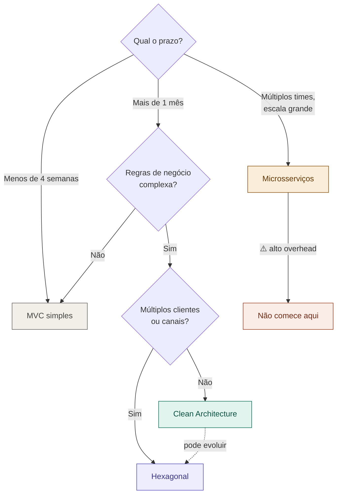

# 10 — Árvore de Decisão de Arquitetura

tags: #arquitetura #decisão
links: [[05 - Comparativo de Arquiteturas]] | [[11 - Estrutura de Pastas Clean Architecture]]

---

## A árvore completa

---

## Critérios de decisão resumidos

### Use MVC se...
- Prazo < 4 semanas
- Time está aprendendo
- Funcionalidades são CRUD simples
- Framework já impõe MVC (Laravel, Django, Rails)

### Use Clean Architecture se...
- Regras de negócio são complexas
- Precisa de cobertura de testes alta
- Sistema vai durar e evoluir por meses/anos
- Time tem experiência com injeção de dependências

### Use Hexagonal se...
- Mesmo que Clean Architecture, e adicionalmente:
- O sistema é acionado por múltiplos canais (HTTP, fila, CLI, cron)
- Vai trocar de banco ou serviços externos com frequência

### Não use Microsserviços se...
- Time tem menos de 6-8 pessoas
- Não há equipe de infraestrutura dedicada
- O projeto tem menos de 1 ano
- Você está em ambiente acadêmico

---

## Próximas notas
- [[11 - Estrutura de Pastas Clean Architecture]]
- [[13 - Como Escolher Tecnologias]]
