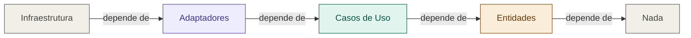

# 12 — Regra de Dependência

tags: #arquitetura #clean #princípios
links: [[03 - Clean Architecture]] | [[11 - Estrutura de Pastas Clean Architecture]]

---

## A regra

> "Dependências de código-fonte só podem apontar para dentro. Nada numa camada interna pode saber qualquer coisa sobre algo numa camada externa."
> — Robert C. Martin

---

## Visualizado



---

## Como a regra é mantida na prática

O truque é a **inversão de dependência**: o domínio define a *interface*, a infraestrutura fornece a *implementação*.

```typescript
// No domínio — define o contrato
interface IEmailService {
  send(to: string, subject: string, body: string): Promise<void>
}

// Na infraestrutura — implementa o contrato
class SendgridEmailService implements IEmailService {
  async send(to, subject, body) {
    await sendgrid.send({ to, subject, html: body })
  }
}

// No caso de uso — usa a interface, não a implementação
class RegisterUser {
  constructor(private email: IEmailService) {}
  async execute(data) {
    // ...cria usuário...
    await this.email.send(data.email, 'Bem-vindo!', '...')
  }
}

// Em main.ts — injeta a implementação concreta
const emailService = new SendgridEmailService()
const registerUser = new RegisterUser(emailService)
```

O domínio nunca viu `SendgridEmailService`. Se trocar para Mailgun, só muda `main.ts`.
