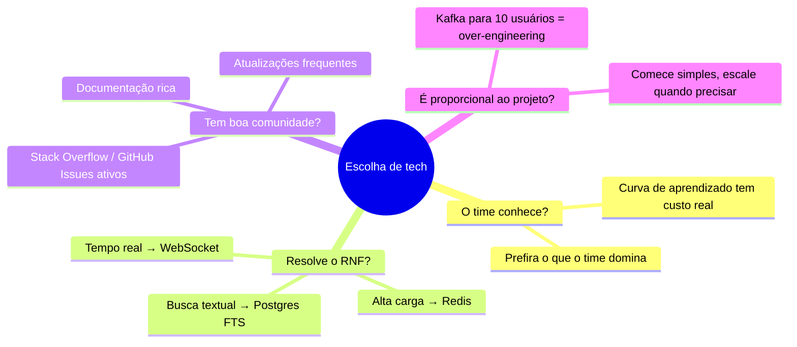

# 13 — Como Escolher Tecnologias

tags: #tecnologias #decisão
links: [[14 - Stack Recomendada para Projetos Acadêmicos]] | [[15 - Quando Adicionar Ferramentas]]

---

## Os 4 critérios

---

## Armadilhas comuns

| Armadilha | Problema | Alternativa |
|---|---|---|
| "Vamos usar microserviços" | Overhead enorme para time pequeno | Monólito bem estruturado |
| "Vamos usar Kubernetes" | Complexidade desnecessária | Railway, Render, Fly.io |
| "Vamos usar GraphQL" | Curva alta, REST resolve | REST com boas rotas |
| "Vamos usar MongoDB porque é moderno" | Sem relações, sem integridade | PostgreSQL para 90% dos casos |

---

## Critério de desempate

> Se duas tecnologias resolvem o mesmo problema igualmente bem, escolha a que o time conhece melhor.

---

## Próximas notas
- [[14 - Stack Recomendada para Projetos Acadêmicos]]
- [[15 - Quando Adicionar Ferramentas]]
