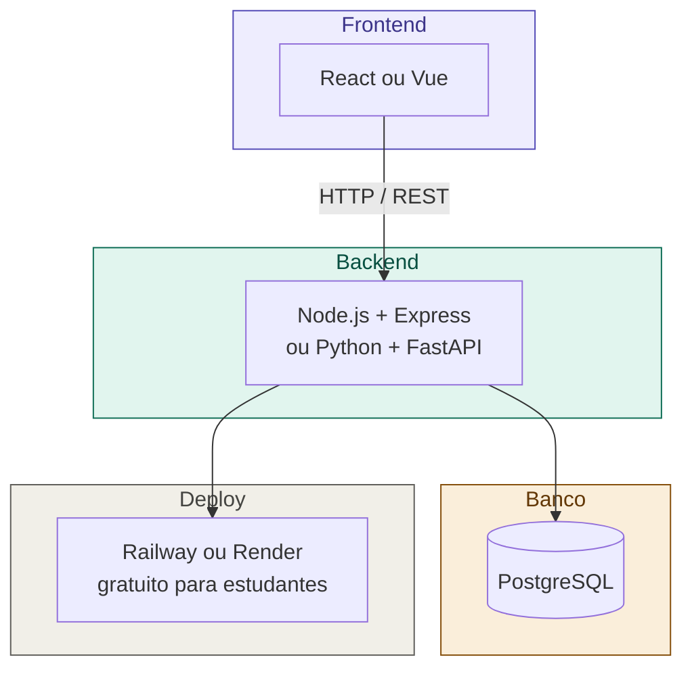

# 14 — Stack Recomendada para Projetos Acadêmicos

tags: #tecnologias #stack
links: [[13 - Como Escolher Tecnologias]] | [[15 - Quando Adicionar Ferramentas]]

---

## Stack base (2-4 pessoas, 1-3 meses)

---

## Por que essas escolhas

| Tecnologia | Motivo |
|---|---|
| **Node.js + Express** | JavaScript full-stack, grande comunidade, simples de iniciar |
| **Python + FastAPI** | Excelente para quem já conhece Python, docs automáticas com OpenAPI |
| **React** | Mercado amplo, muitos recursos de aprendizado |
| **PostgreSQL** | Relacional robusto, gratuito, suporta JSON quando necessário |
| **Railway / Render** | Deploy simples, tier gratuito generoso, sem cartão de crédito |

---

## Adições comuns por tipo de projeto

| Tipo de projeto | Adiciona |
|---|---|
| Chat / notificações em tempo real | Socket.io |
| Upload de arquivos | Multer + S3 (ou Cloudinary gratuito) |
| Autenticação | JWT + bcrypt (sem biblioteca externa de auth) |
| Cache de consultas | Redis (via Upstash — gratuito) |
| Envio de e-mails | Resend ou Nodemailer + Gmail SMTP |
