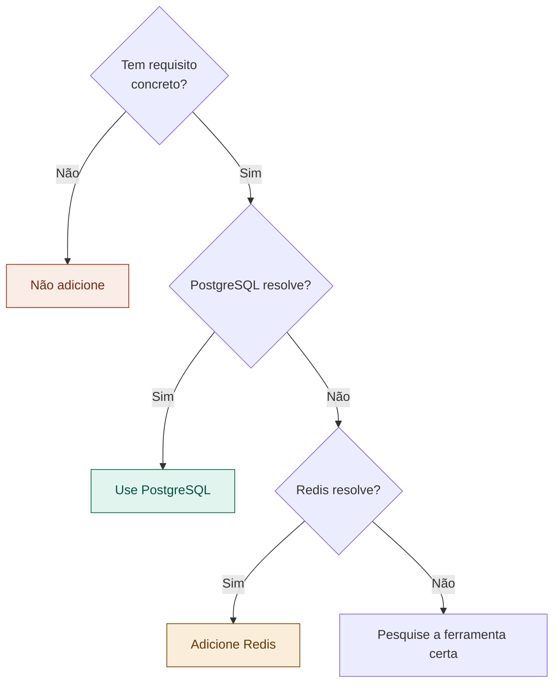

# 15 — Quando Adicionar Ferramentas

tags: #tecnologias #over-engineering
links: [[13 - Como Escolher Tecnologias]] | [[14 - Stack Recomendada para Projetos Acadêmicos]]

---

## Princípio YAGNI

> "You Ain't Gonna Need It" — Não adicione uma ferramenta antes de precisar dela.

Cada nova ferramenta tem custo de aprendizado, manutenção e debugging. Só adicione quando um requisito concreto exigir.

---

## Árvore de decisão de ferramentas

---

## Guia rápido por necessidade

| Precisa de | Solução mínima | Solução avançada |
|---|---|---|
| Cache | PostgreSQL com query otimizada | Redis |
| Fila de tarefas | Tabela no banco com polling | BullMQ + Redis |
| Busca textual | PostgreSQL `tsvector` | Elasticsearch |
| Logs | `console.log` estruturado | Datadog / Loki |
| Tempo real | Polling a cada 5s | WebSocket / SSE |
| Autenticação social | Sessão própria | OAuth com Passport.js |

Sempre comece com a solução mínima. Só mude quando ela provar ser insuficiente.
