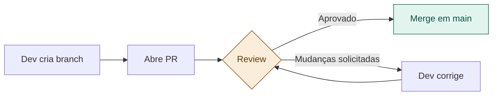

# 17 — Rituais de Time

tags: #time #processo #agile
links: [[16 - Divisão de Responsabilidades]] | [[18 - Lidando com Requisitos que Mudam]]

---

## Os rituais essenciais para times de 2-4 pessoas

### Daily (10 min, todo dia ou a cada 2 dias)

Três perguntas só:
1. O que fiz desde o último daily?
2. O que vou fazer até o próximo?
3. Tem algum bloqueio?

> Não é reunião de status para o professor. É para o *time* se sincronizar e desbloquear uns aos outros.

---

### Revisão de PR (Pull Request)

**Regra:** ninguém sobe código direto na branch `main`. Todo código passa por review de pelo menos 1 pessoa.

**O que revisar:**
- O código viola a [[12 - Regra de Dependência]]?
- Tem teste para a funcionalidade?
- O nome das variáveis e funções é claro?
- Tem algo que você não entendeu? (se sim, precisa ser mais claro)

---

### Planning de sprint (a cada 1-2 semanas)

1. Revisa o que foi feito
2. Seleciona as próximas user stories do backlog
3. Divide as tarefas entre o time
4. Estima em horas (não dias — é mais preciso)

---

### Retrospectiva (ao final de cada sprint)

Três perguntas:
1. O que funcionou bem?
2. O que podemos melhorar?
3. Qual é a uma coisa que vamos mudar no próximo sprint?

---

## Próximas notas
- [[18 - Lidando com Requisitos que Mudam]]
- [[19 - Contrato de API]]
