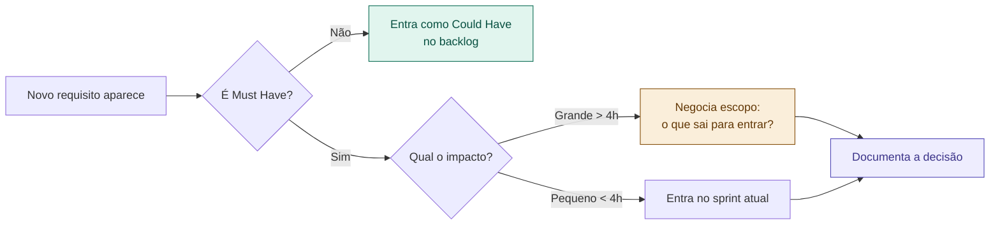

# 18 — Lidando com Requisitos que Mudam

tags: #time #requisitos #processo
links: [[09 - Priorização com MoSCoW]] | [[17 - Rituais de Time]]

---

## A realidade

Requisitos vão mudar. Sempre. A questão não é *se*, é *quando* e *como responder*.

> Times que travam quando requisitos mudam geralmente não têm processo — não falta técnica, falta ritual de decisão.

---

## O processo de 4 passos



---

## Como documentar a decisão

Adicione ao README ou ao documento de visão:

```markdown
## Decisões de escopo

### [Data] — Adicionado: notificações por e-mail
- Motivo: requisito do professor identificado tarde
- Impacto: +6h estimadas
- O que saiu: relatórios PDF (movido para Won't Have)
- Decisão tomada por: time completo na daily de DD/MM
```

---

## O erro mais comum

Aceitar todo novo requisito sem negociar o que sai. O resultado é um escopo que cresce infinitamente e um time que nunca termina nada.

> Todo "sim" para algo novo precisa de um "não" para algo antigo — ou de mais prazo.

---

## Próximas notas
- [[19 - Contrato de API]]
- [[09 - Priorização com MoSCoW]]
