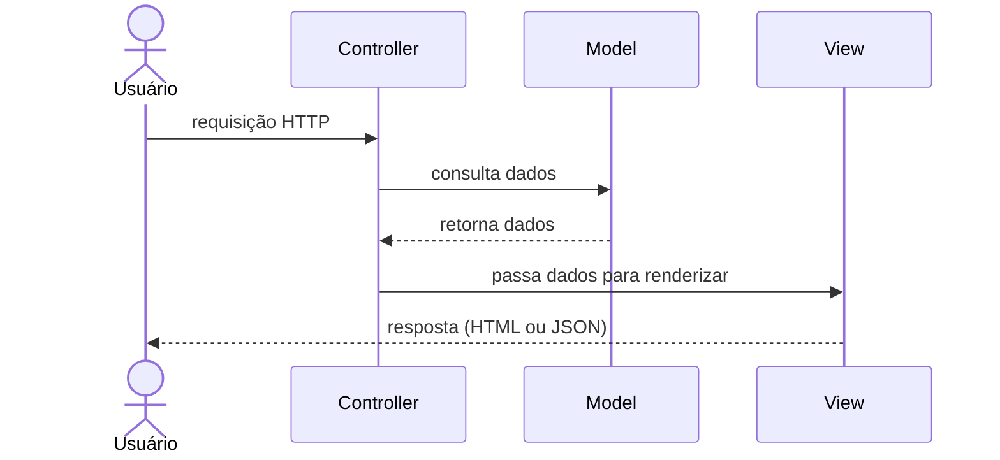

# 02 — MVC (Model-View-Controller)

tags: #fundamentos #arquitetura #padrão
links: [[01 - Por que Arquitetura Existe]] | [[03 - Clean Architecture]] | [[Estudos/Projetos/00-Maps/🗺️ Mapa Principal]]

---

## O que é

MVC divide a aplicação em três responsabilidades distintas:

| Camada | Responsabilidade |
|---|---|
| **Model** | Dados e regras de negócio, acesso ao banco |
| **View** | Apresentação — o que o usuário vê |
| **Controller** | Recebe a requisição, chama o Model e decide qual View renderizar |

---

## Como funciona



---

## Exemplo de código

```javascript
// Controller
class UserController {
  async show(req, res) {
    const user = await UserModel.findById(req.params.id) // chama Model
    return res.json(user)                                // responde (View)
  }
}

// Model
class UserModel {
  static async findById(id) {
    return db.query('SELECT * FROM users WHERE id = $1', [id])
  }
}
```

---

## Quando usar

✅ **Use MVC quando:**
- Projeto simples com prazo curto
- Time está aprendendo separação de responsabilidades
- MVP ou hackathon
- Frameworks como Laravel, Django, Rails, Spring MVC

❌ **Evite MVC quando:**
- Regras de negócio são complexas (o Model vai inchar)
- Você precisa de alta cobertura de testes unitários
- O mesmo domínio vai ser acessado por múltiplos clientes

---

## Problema clássico do MVC ao escalar

```
Controller gordo:
- Valida entrada
- Chama banco diretamente
- Manda e-mail
- Registra log
- Retorna resposta
→ 200 linhas numa função só
```

Quando isso acontece, é sinal para migrar para [[03 - Clean Architecture]].

---

## Onde aparece no mercado

- **Laravel (PHP)** — MVC mais popular do ecossistema PHP
- **Django (Python)** — chama de MTV, mas é MVC na prática
- **Ruby on Rails** — o MVC original da web moderna
- **Spring MVC (Java)** — muito usado em empresas

---

## Próximas notas
- [[03 - Clean Architecture]] — quando o MVC não é mais suficiente
- [[05 - Comparativo de Arquiteturas]] — MVC vs Clean vs Hexagonal
