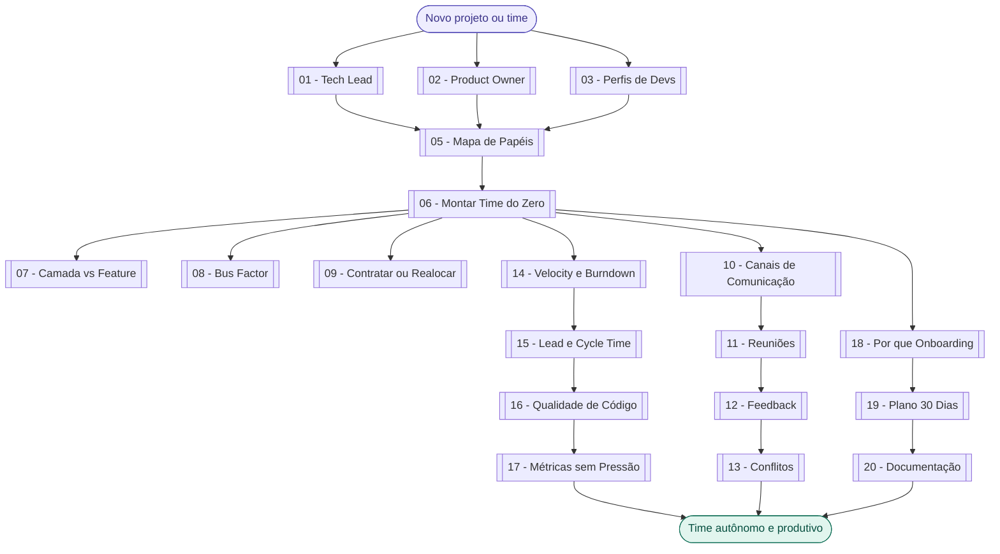
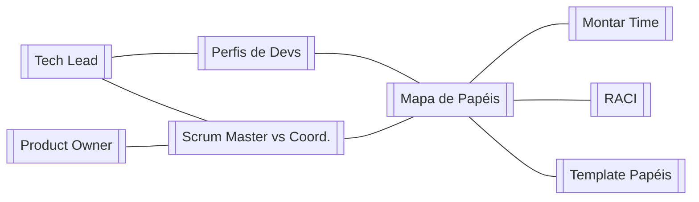
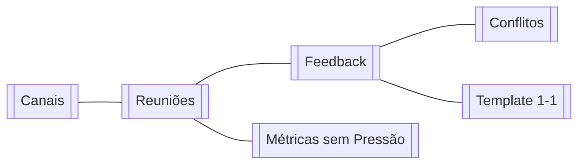
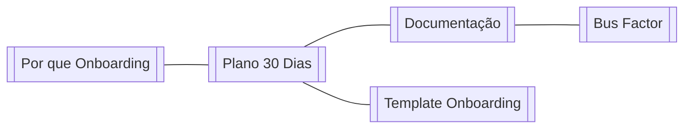

# 🔗 Mapa de Conexões — Gestão de Times

tags: #moc #grafo
links: [[Estudos/Gest. Pessoas/00-Maps/🗺️ Mapa Principal]]

---

> Esta nota cria conexões explícitas entre todas as notas do vault para o Graph View do Obsidian.

---

## Fluxo completo

---

## Mapa temático — Papéis

---

## Mapa temático — Comunicação

---

## Mapa temático — Onboarding

---

## Todos os links do vault

[[01 - O que é um Tech Lead]]
[[02 - O que é um Product Owner]]
[[03 - Perfis de Desenvolvedores]]
[[04 - Scrum Master vs Coordenador de Projeto]]
[[05 - Mapa de Papéis por Tamanho de Time]]
[[06 - Como Montar um Time do Zero]]
[[07 - Divisão por Camada vs por Feature]]
[[08 - Bus Factor e Conhecimento Compartilhado]]
[[09 - Quando Contratar ou Realocar]]
[[10 - Canais de Comunicação e Quando Usar]]
[[11 - Reuniões que Funcionam]]
[[12 - Como Dar e Receber Feedback]]
[[13 - Gestão de Conflitos no Time]]
[[14 - Velocity e Burndown]]
[[15 - Lead Time e Cycle Time]]
[[16 - Métricas de Qualidade de Código]]
[[17 - Como Usar Métricas sem Criar Pressão Tóxica]]
[[18 - Por que Onboarding Importa]]
[[19 - Plano de Onboarding em 30 Dias]]
[[20 - Documentação que o Time Realmente Lê]]
[[Template - Plano de Onboarding]]
[[Template - Feedback 1-1]]
[[Template - Definição de Papéis do Time]]
[[Template - Matriz RACI]]
