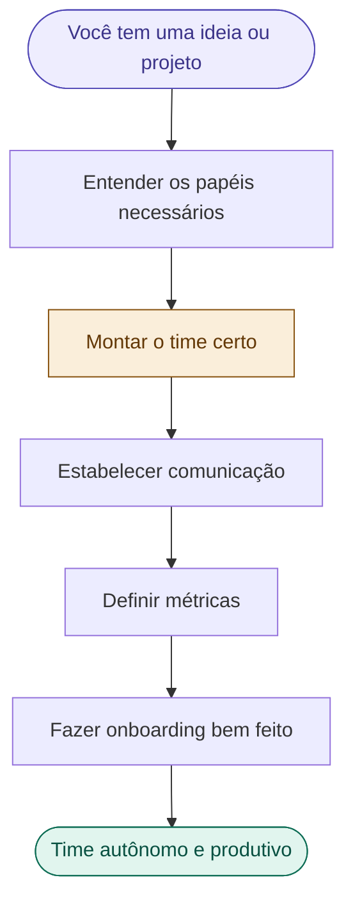
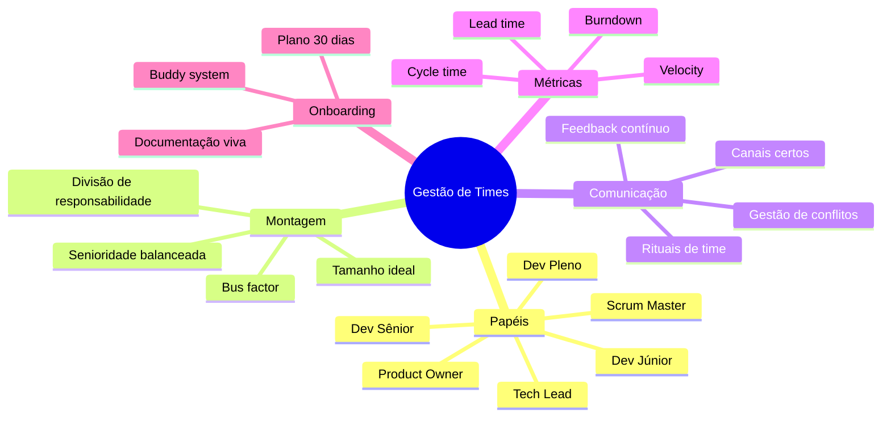

# 🗺️ Mapa Principal — Divisão e Gestão de Times

> Apostila com foco em gestão de pessoas, liderança técnica e organização de times de software.
> Ideal para coordenadores, tech leads e quem está montando um time do zero.

---

## Fluxo do gestor — do time ao produto

---

## Índice de notas

### Papéis e perfis
- [[01 - O que é um Tech Lead]]
- [[02 - O que é um Product Owner]]
- [[03 - Perfis de Desenvolvedores]]
- [[04 - Scrum Master vs Coordenador de Projeto]]
- [[05 - Mapa de Papéis por Tamanho de Time]]

### Montando o time
- [[06 - Como Montar um Time do Zero]]
- [[07 - Divisão por Camada vs por Feature]]
- [[08 - Bus Factor e Conhecimento Compartilhado]]
- [[09 - Quando Contratar ou Realocar]]

### Comunicação e conflitos
- [[10 - Canais de Comunicação e Quando Usar]]
- [[11 - Reuniões que Funcionam]]
- [[12 - Como Dar e Receber Feedback]]
- [[13 - Gestão de Conflitos no Time]]

### Métricas de time
- [[14 - Velocity e Burndown]]
- [[15 - Lead Time e Cycle Time]]
- [[16 - Métricas de Qualidade de Código]]
- [[17 - Como Usar Métricas sem Criar Pressão Tóxica]]

### Onboarding
- [[18 - Por que Onboarding Importa]]
- [[19 - Plano de Onboarding em 30 Dias]]
- [[20 - Documentação que o Time Realmente Lê]]

### Templates
- [[Template - Plano de Onboarding]]
- [[Template - Feedback 1-1]]
- [[Template - Definição de Papéis do Time]]
- [[Template - Matriz RACI]]

---

## Mapa mental — visão geral

