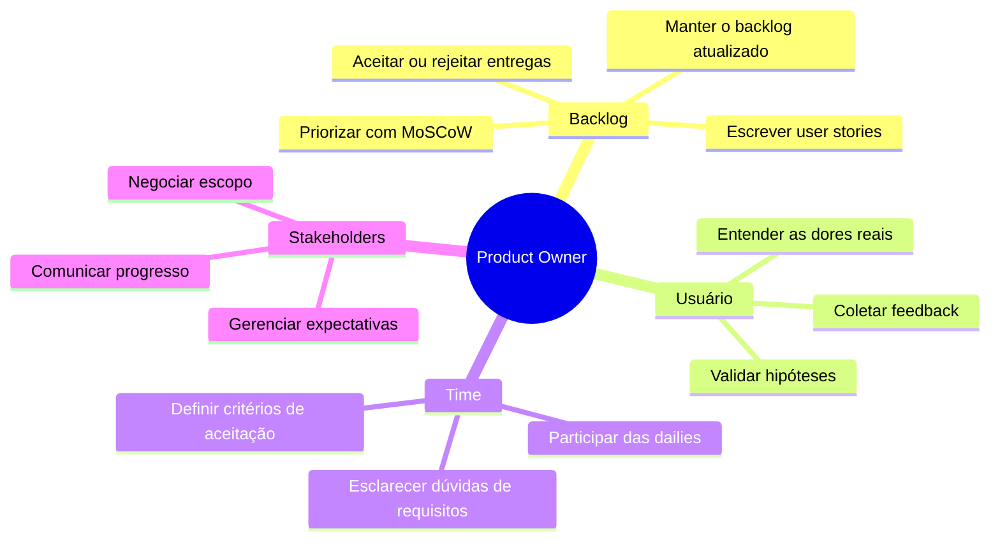

# 02 — O que é um Product Owner

tags: #papéis #product-owner #gestão
links: [[01 - O que é um Tech Lead]] | [[04 - Scrum Master vs Coordenador de Projeto]]

---

## Definição

O Product Owner (PO) é o responsável por **o que** o time constrói e **por quê**. Ele representa os interesses do usuário e do negócio dentro do time de desenvolvimento.

> O Tech Lead decide *como* construir. O PO decide *o que* construir e *em que ordem*.

---

## Responsabilidades do PO

---

## O PO não é gerente de projeto

| PO faz | Gerente de projeto faz |
|---|---|
| Define *o que* será construído | Define *como* o projeto será gerenciado |
| Prioriza o backlog | Controla cronograma e recursos |
| Representa o usuário | Representa o contratante |
| Diz o *porquê* de cada feature | Diz *quando* cada entrega acontece |

Em times acadêmicos pequenos, uma pessoa pode acumular os dois papéis — mas é importante ter consciência de qual chapéu está usando em cada momento.

---

## O PO em times acadêmicos

Na faculdade, o PO costuma ser o coordenador do projeto ou quem tem mais contato com o "cliente" (professor, usuário real, banca).

**Responsabilidades práticas:**
- Escrever e manter o backlog de user stories
- Estar disponível para tirar dúvidas do time sobre requisitos
- Validar as entregas de cada sprint antes do review
- Negociar escopo com o professor/orientador

---

## Antipadrões comuns do PO

| Antipadrão | Consequência |
|---|---|
| PO ausente — aparece só no review | Time constrói a coisa errada |
| PO que muda requisitos toda semana | Time perde confiança e ritmo |
| PO que vira gestor técnico | Conflito com Tech Lead, time confuso |
| PO que aceita tudo — sem priorização | Escopo infinito, nada é entregue |

---

## Próximas notas
- [[03 - Perfis de Desenvolvedores]]
- [[04 - Scrum Master vs Coordenador de Projeto]]
