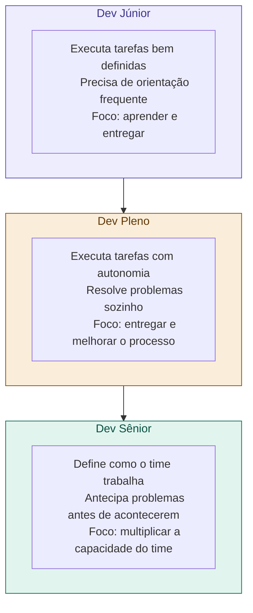

# 03 — Perfis de Desenvolvedores

tags: #papéis #desenvolvedores #senioridade
links: [[01 - O que é um Tech Lead]] | [[05 - Mapa de Papéis por Tamanho de Time]]

---

## Os três níveis e o que realmente os diferencia

A senioridade não é sobre anos de experiência. É sobre **autonomia**, **impacto** e **amplitude de visão**.

---

## Tabela comparativa

| Critério | Júnior | Pleno | Sênior |
|---|---|---|---|
| **Autonomia** | Precisa de tasks detalhadas | Resolve sozinho, comunica bloqueios | Define como o problema deve ser resolvido |
| **Code review** | Recebe revisão | Dá e recebe revisão | Leva o padrão do time |
| **Escopo** | Uma task por vez | Uma feature por vez | Um módulo ou sistema inteiro |
| **Comunicação** | Pergunta antes de agir | Tenta, registra, comunica | Antecipa e documenta decisões |
| **Erros** | Comete e aprende com orientação | Comete, identifica e corrige | Previne erros estruturais do time |
| **Reuniões** | Ouve e executa | Contribui com soluções | Define direção e facilita decisões |

---

## Como distribuir em um time de 4 pessoas

| Composição | Quando funciona |
|---|---|
| 1 sênior + 2 plenos + 1 júnior | Projeto com prazo razoável, sênior atua como Tech Lead |
| 2 plenos + 2 júniors | Projeto simples, plenos se revezam na liderança |
| 1 sênior + 3 júniors | Funciona se o sênior tiver tempo para mentoria — arriscado |
| 4 júniors | Não recomendado — alto risco de decisões ruins sem referência |

---

## Próximas notas
- [[04 - Scrum Master vs Coordenador de Projeto]]
- [[05 - Mapa de Papéis por Tamanho de Time]]
