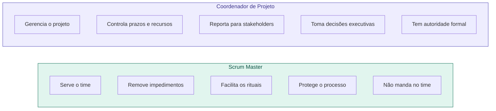

# 04 — Scrum Master vs Coordenador de Projeto

tags: #papéis #scrum #coordenação
links: [[02 - O que é um Product Owner]] | [[05 - Mapa de Papéis por Tamanho de Time]]

---

## A confusão mais comum em times iniciantes

Muita gente confunde Scrum Master com gerente de projeto ou coordenador. São papéis com filosofias muito diferentes.

---

## Comparação direta

| | Scrum Master | Coordenador de Projeto |
|---|---|---|
| **Autoridade** | Nenhuma — é um facilitador | Formal — toma decisões |
| **Foco** | Processo e time | Prazo, escopo e custo |
| **Relação com o time** | Servo-líder | Gestor |
| **Origem** | Metodologias ágeis (Scrum) | Gestão de projetos clássica (PMI) |
| **Pergunta central** | "O time está funcionando bem?" | "O projeto vai entregar no prazo?" |

---

## Em contextos acadêmicos

Na faculdade, o coordenador do grupo geralmente acumula os dois papéis. O ideal é ter consciência de quando está agindo como cada um:

- **Chapéu de Scrum Master:** facilitar a daily, remover bloqueios, garantir que o processo está sendo seguido
- **Chapéu de Coordenador:** reportar progresso ao professor, negociar prazo, tomar decisões de escopo

---

## Próxima nota
- [[05 - Mapa de Papéis por Tamanho de Time]]
