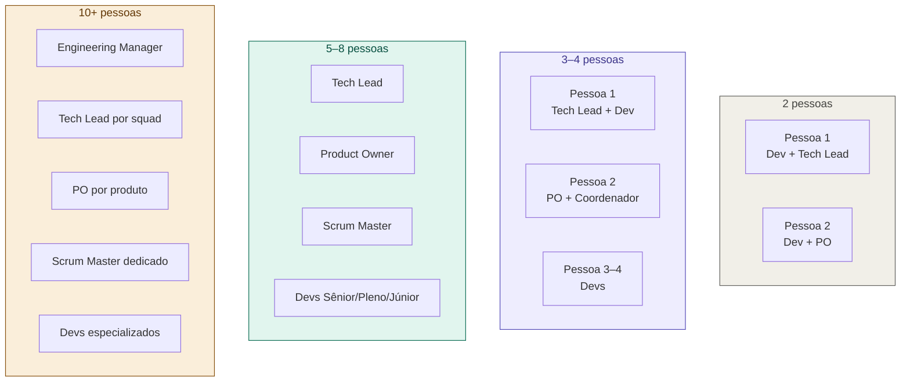

# 05 — Mapa de Papéis por Tamanho de Time

tags: #papéis #estrutura #times
links: [[06 - Como Montar um Time do Zero]] | [[Estudos/Projetos/00-Maps/🗺️ Mapa Principal]]

---

## A regra dos papéis mínimos

Todo time de software, independente do tamanho, precisa garantir que três perguntas tenham um dono:

| Pergunta | Papel responsável |
|---|---|
| **O que construir?** | Product Owner |
| **Como construir?** | Tech Lead |
| **O time está funcionando?** | Scrum Master / Coordenador |

Em times pequenos, uma pessoa pode acumular papéis — mas nunca deixe uma pergunta sem dono.

---

## Configurações por tamanho



---

## Para times acadêmicos (2–4 pessoas)

A configuração mais eficiente:

```
Coordenador do grupo
├── Acumula: PO + Scrum Master + Dev
├── Foco: requisitos, comunicação com professor, rituais
└── Coda menos, facilita mais

Dev mais experiente
├── Acumula: Tech Lead + Dev Sênior
├── Foco: arquitetura, code review, padrões
└── Tem voz final em decisões técnicas

Demais membros
├── Papel: Dev Pleno ou Júnior
└── Foco: implementação das user stories
```

---

## Quando os papéis ficam difusos

Sinal de alerta: quando ninguém sabe quem decide o quê.

**Sintomas:**
- Decisões técnicas são tomadas pelo coordenador (que não é tech lead)
- O dev mais vocal vira PO informal sem ter visão do usuário
- Ninguém facilita os rituais — as reuniões viram bagunça
- Conflitos não são resolvidos porque não há autoridade clara

**Solução:** reunião de 30 minutos para declarar explicitamente quem é responsável por cada pergunta. Use o [[Template - Definição de Papéis do Time]].

---

## Próximas notas
- [[06 - Como Montar um Time do Zero]]
- [[Template - Definição de Papéis do Time]]
