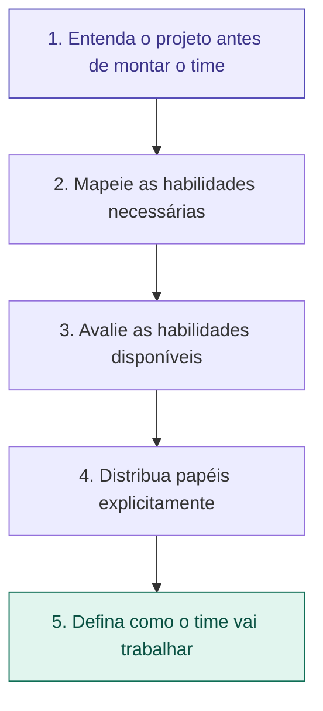

# 06 — Como Montar um Time do Zero

tags: #montagem #time #estrutura
links: [[07 - Divisão por Camada vs por Feature]] | [[08 - Bus Factor e Conhecimento Compartilhado]]

---

## O processo em 5 passos



---

## Passo 1 — Entenda o projeto antes de montar o time

Antes de qualquer coisa, responda:
- Qual é o tipo do sistema? (API, frontend, mobile, dados?)
- Qual a complexidade técnica esperada?
- Qual o prazo e nível de entrega exigido?

> Um sistema com banco de dados relacional complexo precisa de alguém que entenda SQL de verdade. Um app mobile precisa de alguém com experiência em React Native ou Swift. Montar o time sem saber o projeto é apostar no escuro.

---

## Passo 2 — Mapeie as habilidades necessárias

Liste as competências que o projeto vai exigir:

```
Habilidades técnicas:
□ Backend (Node, Python, Java...)
□ Frontend (React, Vue...)
□ Banco de dados (SQL, modelagem)
□ Infraestrutura / deploy
□ Testes automatizados

Habilidades de processo:
□ Alguém que saiba escrever requisitos
□ Alguém que saiba facilitar reuniões
□ Alguém com visão do usuário final
```

---

## Passo 3 — Avalie as habilidades disponíveis

Use a **Matriz de Habilidades** para mapear o time:

| Pessoa | Backend | Frontend | Banco | Deploy | Requisitos |
|---|---|---|---|---|---|
| Alice | ★★★ | ★★☆ | ★★★ | ★☆☆ | ★★☆ |
| Bruno | ★★☆ | ★★★ | ★☆☆ | ★★☆ | ★★★ |
| Carla | ★☆☆ | ★★★ | ★★☆ | ★☆☆ | ★☆☆ |

Identifique os gaps: se ninguém tem deploy, quem vai aprender? Se só uma pessoa sabe banco, qual é o risco?

---

## Passo 4 — Distribua papéis explicitamente

Após o mapeamento, a conversa com o time precisa ser explícita:

> "Vou propor a seguinte divisão. Quero que vocês me digam se concordam e se há algo que eu não vi."

Nunca assuma que os papéis são óbvios. O que parece óbvio para você pode não ser para o time.

---

## Passo 5 — Defina como o time vai trabalhar

Antes do primeiro sprint:
- Qual ferramenta de gestão? (Trello, Jira, Notion, Linear)
- Qual a cadência de reuniões?
- Como será feito o code review?
- Onde fica a documentação?
- Como decisões são tomadas — consenso ou o Tech Lead decide?

> Processo combinado antes de começar vale mais do que processo imposto no meio do projeto.

---

## Próximas notas
- [[07 - Divisão por Camada vs por Feature]]
- [[08 - Bus Factor e Conhecimento Compartilhado]]
