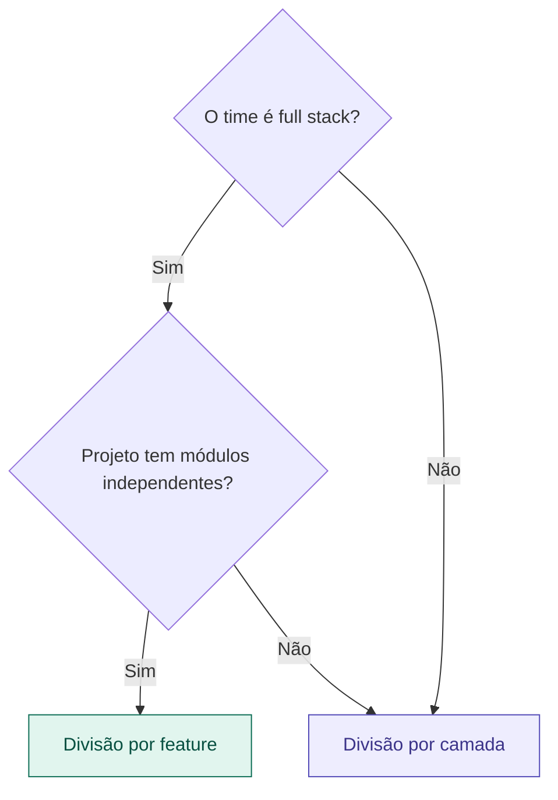

# 07 — Divisão por Camada vs por Feature

tags: #montagem #estrutura #responsabilidade
links: [[06 - Como Montar um Time do Zero]] | [[08 - Bus Factor e Conhecimento Compartilhado]]

---

## Duas formas de dividir o trabalho

Quando o time começa a codar, há duas formas principais de distribuir quem faz o quê.

---

## Divisão por camada

Cada pessoa é responsável por uma camada técnica do sistema.

```
Alice   → Backend (API, lógica de negócio, banco)
Bruno   → Frontend (telas, componentes, UX)
Carla   → Infra (deploy, CI/CD, ambiente)
```

**Vantagens:**
- Conflitos de merge são raros — cada um trabalha em arquivos diferentes
- Cada pessoa desenvolve profundidade técnica
- Fácil de entender quem chamar para qual problema

**Desvantagens:**
- Feature nova exige coordenação entre todas as camadas
- Se Alice travar, Bruno fica esperando
- Conhecimento fica siloado — Bruno não sabe nada do backend

---

## Divisão por feature

Cada pessoa é responsável por uma funcionalidade de ponta a ponta.

```
Alice   → Módulo de autenticação (backend + frontend + banco)
Bruno   → Módulo de pedidos (backend + frontend + banco)
Carla   → Módulo de relatórios (backend + frontend + banco)
```

**Vantagens:**
- Cada um entrega features completas de forma autônoma
- Menos dependência entre pessoas
- Conhecimento mais distribuído

**Desvantagens:**
- Conflitos de merge mais frequentes (todos mexem no mesmo projeto)
- Exige que todos tenham habilidades full stack
- Risco de inconsistência entre módulos sem um Tech Lead que revise

---

## Qual escolher?



**Para times acadêmicos de 2–4 pessoas:** divisão por camada costuma ser mais segura. Menos conflitos, mais foco.

---

## Abordagem híbrida (recomendada)

Na prática, o melhor é um meio-termo:

- Cada pessoa tem uma **camada principal** de responsabilidade
- Mas todos precisam entender o suficiente das outras camadas para não ficarem completamente bloqueados
- O Tech Lead revisa todo o código independente de camada

---

## Próximas notas
- [[08 - Bus Factor e Conhecimento Compartilhado]]
- [[09 - Quando Contratar ou Realocar]]
