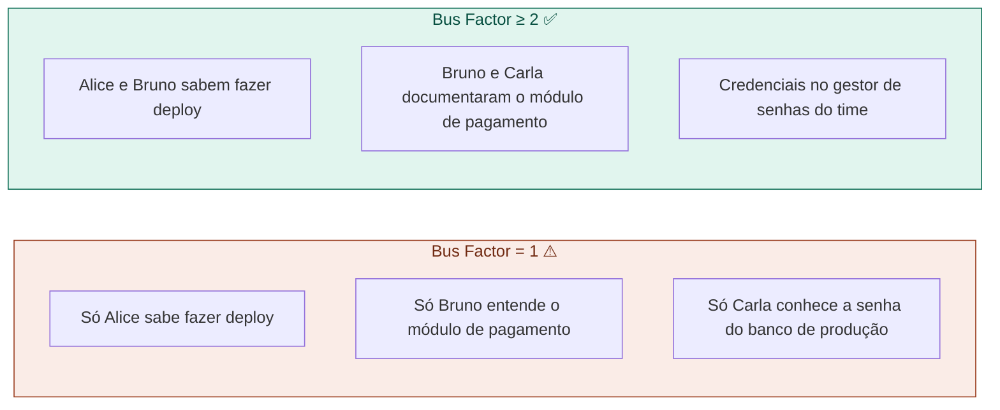

# 08 — Bus Factor e Conhecimento Compartilhado

tags: #montagem #risco #conhecimento
links: [[07 - Divisão por Camada vs por Feature]] | [[20 - Documentação que o Time Realmente Lê]]

---

## O que é Bus Factor

> Bus Factor = quantas pessoas do time precisariam ser "atropeladas por um ônibus" para o projeto parar.

Se a resposta for **1**, o projeto tem risco crítico. Uma pessoa saiu de férias, ficou doente ou simplesmente saiu do grupo — e o projeto trava.

---

## Como identificar pontos de risco

---

## Como aumentar o Bus Factor

**1. Pair programming rotativo**
Não deixe a mesma dupla trabalhando sempre junta. Rotacione para que todos passem por todas as partes críticas.

**2. Code review obrigatório**
Todo PR revisado por alguém que não escreveu o código. Além de qualidade, isso distribui conhecimento.

**3. Documentação de decisões (ADRs)**
Por que escolhemos PostgreSQL? Por que o módulo X funciona assim? Registre em [[Template - Decisão de Arquitetura]] antes que a pessoa que decidiu saia.

**4. Rotação de responsabilidades**
A cada sprint, mude quem faz o deploy, quem facilita a daily, quem lidera o code review.

**5. Sessões de conhecimento (tech talks)**
Uma vez por sprint, alguém explica para o time como uma parte do sistema funciona. 20 minutos. Registra no Obsidian.

---

## Bus Factor em projetos acadêmicos

O risco é especialmente alto porque:
- Times se desmontam ao fim do semestre
- Membros saem sem documentar nada
- O próximo grupo herda código que ninguém entende

**Mínimo aceitável:** qualquer parte crítica do sistema deve ser entendida por pelo menos 2 pessoas do time.

---

## Próxima nota
- [[09 - Quando Contratar ou Realocar]]
