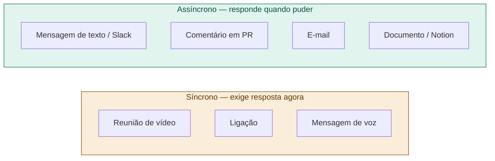

# 10 — Canais de Comunicação e Quando Usar

tags: #comunicação #processo
links: [[11 - Reuniões que Funcionam]] | [[12 - Como Dar e Receber Feedback]]

---

## O problema da comunicação mal escolhida

Usar o canal errado gera ruído, urgência falsa e interrupção desnecessária.

---

## Guia de uso por situação

| Situação | Canal recomendado | Por quê |
|---|---|---|
| Bloqueio urgente que trava entrega | Mensagem direta + ligação se não responder | Urgente e específico |
| Dúvida técnica sobre o código | Comentário no PR ou issue | Fica registrado, todos veem |
| Decisão de arquitetura | Reunião → registra em ADR | Precisa de discussão, mas deixa rastro |
| Atualização de progresso | Daily / mensagem no canal do time | Todos precisam saber, ninguém precisa responder agora |
| Feedback pessoal | 1-1 privado (vídeo ou presencial) | Nunca em canal público |
| Mudança de requisito | Mensagem formal + atualização no backlog | Precisa de rastreabilidade |
| Dúvida simples de processo | Mensagem no grupo | Rápido, não bloqueia ninguém |

---

## Regras de ouro

**1. Nunca use mensagem de grupo para cobrar alguém individualmente.**
Isso constrange e cria clima ruim. Use mensagem direta.

**2. Decisões importantes nunca ficam só no Whatsapp.**
Whatsapp é para comunicação rápida. Decisões de arquitetura, escopo e prazo precisam de registro formal.

**3. Respeite o tempo de resposta assíncrono.**
Mandar mensagem e esperar resposta em 5 minutos é comunicação síncrona disfarçada de assíncrona.

---

## Próximas notas
- [[11 - Reuniões que Funcionam]]
- [[12 - Como Dar e Receber Feedback]]
