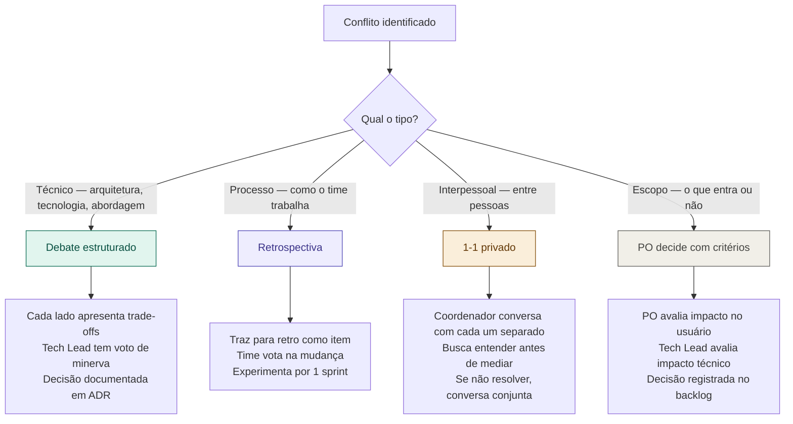

# 13 — Gestão de Conflitos no Time

tags: #comunicação #conflitos #liderança
links: [[12 - Como Dar e Receber Feedback]] | [[11 - Reuniões que Funcionam]]

---

## Conflito não é problema — evitar conflito é

Times sem conflito não existem. O que diferencia times saudáveis é como os conflitos são resolvidos — não sua ausência.

> Conflito técnico bem gerenciado gera melhores decisões. Conflito pessoal mal gerenciado destrói times.

---

## Tipos de conflito e como tratar cada um



---

## O conflito técnico mais comum: "minha abordagem é melhor"

Quando dois devs discordam sobre a solução técnica, o papel do Tech Lead é estruturar a decisão:

```
1. Cada pessoa apresenta sua proposta em 5 min
2. Listam os trade-offs de cada uma (não os benefícios — os custos)
3. Avaliam qual atende melhor os requisitos não-funcionais do projeto
4. Tech Lead decide se o consenso não for alcançado
5. Decisão é documentada — inclusive por que a outra foi descartada
```

---

## Sinais de conflito interpessoal que precisa de atenção

- Alguém para de falar nas reuniões de grupo
- PRs ficam sem revisão por muito tempo (passivo-agressivo)
- Conversas paralelas que excluem membros do time
- Comentários irônicos em código ou mensagens
- "Eu avisei" dito após um problema

**Como coordenador, aja cedo.** Conflito interpessoal ignorado se torna ruptura de time.

---

## O script do 1-1 para conflitos

Quando perceber tensão entre membros:

```
"Percebi uma tensão entre você e [nome] nas últimas semanas.
Quero entender sua perspectiva antes de qualquer conclusão.
O que está acontecendo do seu ponto de vista?"

→ Escuta sem interromper
→ Valida o sentimento, não necessariamente o conteúdo
→ Pergunta: "O que você precisaria para isso melhorar?"
→ Repete com a outra pessoa
→ Só então decide se faz mediação conjunta
```

---

## Próximas notas
- [[14 - Velocity e Burndown]]
- [[11 - Reuniões que Funcionam]]
