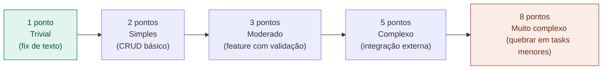

# 14 — Velocity e Burndown

tags: #métricas #agile #sprint
links: [[15 - Lead Time e Cycle Time]] | [[17 - Como Usar Métricas sem Criar Pressão Tóxica]]

---

## Velocity — o quanto o time entrega por sprint

Velocity é a soma dos **story points** completados em um sprint. É uma medida de capacidade, não de velocidade ou esforço.

```
Sprint 1: 18 pontos entregues
Sprint 2: 22 pontos entregues
Sprint 3: 19 pontos entregues
Velocity média: ~20 pontos/sprint
```

**Para que serve:**
- Planejar quantas stories cabem no próximo sprint
- Identificar tendências (o time está acelerando ou desacelerando?)
- Estimar quando o projeto vai terminar

**Para que NÃO serve:**
- Comparar times diferentes entre si
- Medir o valor entregue ao usuário
- Avaliar desempenho individual

---

## Story Points — como estimar

Story points medem **esforço relativo**, não horas.



**Planning Poker:** todos estimam simultaneamente (cartas ou dedos). Discrepâncias grandes revelam incompreensões sobre o escopo — e essa discussão é o valor real da estimativa.

---

## Burndown Chart

Mostra o trabalho restante ao longo do sprint. Permite ver se o time está no ritmo certo.

```
Pontos
restantes
  30 |\.
  25 |  \.
  20 |    \.___    ← ideal (linha reta)
  15 |         \.
  10 |           \.___
   5 |                \.
   0 |__________________|
     Dia 1          Dia 10
```

**Burndown abaixo do ideal:** o time está adiantado ou sobrestimou.
**Burndown acima do ideal:** o time está atrasado — discutir na daily.
**Burndown plano por vários dias:** alguém está bloqueado e não comunicou.

---

## Próximas notas
- [[15 - Lead Time e Cycle Time]]
- [[17 - Como Usar Métricas sem Criar Pressão Tóxica]]
