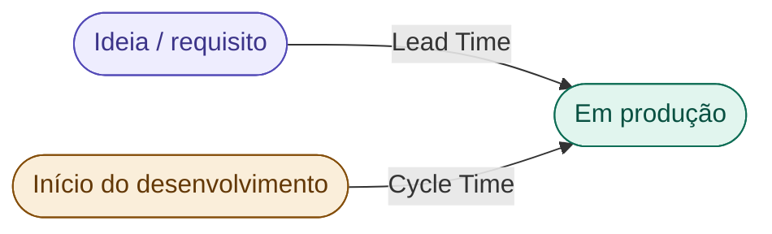

# 15 — Lead Time e Cycle Time

tags: #métricas #fluxo #qualidade
links: [[14 - Velocity e Burndown]] | [[16 - Métricas de Qualidade de Código]]

---

## As duas métricas de fluxo mais importantes

**Lead Time:** tempo desde a ideia até estar em produção. Inclui espera, aprovação, etc.

**Cycle Time:** tempo desde o início do desenvolvimento até estar em produção. Mede a eficiência técnica do time.

---

## Por que essas métricas importam mais que velocity

Velocity mede quanto o time produz. Lead/Cycle time medem **quão rapidamente valor chega ao usuário**.

Um time pode ter alta velocity e péssimo lead time se as features ficam presas em aprovações, testes manuais ou deploys lentos.

---

## Onde o tempo é desperdiçado (gargalos comuns)

| Etapa | Gargalo típico |
|---|---|
| Backlog → desenvolvimento | Requisito mal escrito, dependência de aprovação |
| Em desenvolvimento | Bloqueio técnico, falta de clareza |
| Code review | PR aberto por dias sem revisão |
| QA / testes | Processo manual, ambiente quebrado |
| Deploy | Deploy manual, pipeline quebrado |

---

## Meta prática para times acadêmicos

| Métrica | Meta razoável |
|---|---|
| Cycle time de uma user story | 1–3 dias |
| Tempo de PR aberto sem revisão | Máximo 24h |
| Lead time de uma feature pequena | 3–5 dias |

---

## Próximas notas
- [[16 - Métricas de Qualidade de Código]]
- [[17 - Como Usar Métricas sem Criar Pressão Tóxica]]
