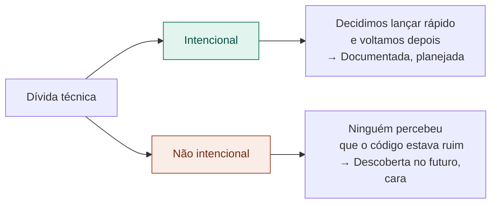

# 16 — Métricas de Qualidade de Código

tags: #métricas #qualidade #código
links: [[15 - Lead Time e Cycle Time]] | [[17 - Como Usar Métricas sem Criar Pressão Tóxica]]

---

## As métricas que o Tech Lead precisa acompanhar

### Cobertura de testes

Percentual de linhas de código cobertas por testes automatizados.

| Cobertura | Interpretação |
|---|---|
| < 40% | Alto risco — mudanças quebram coisas sem aviso |
| 40–70% | Aceitável para times iniciantes |
| 70–85% | Bom — cobre os caminhos críticos |
| > 85% | Ótimo — mas cuidado com testes de baixa qualidade |

> Cobertura alta com testes ruins é pior do que cobertura média com testes úteis.

---

### Taxa de bugs em produção

Quantos bugs chegam ao usuário final por sprint. Tendência importa mais que número absoluto.

- Subindo → processo de QA ou cobertura de testes com problema
- Estável → processo controlado
- Caindo → time amadurecendo

---

### Dívida técnica (qualitativo)

Dívida técnica é código que funciona mas que vai custar caro para manter ou evoluir.

**Como gerenciar:** reserve 10–20% da capacidade de cada sprint para refatoração e pagamento de dívida técnica.

---

### Tempo de build / pipeline de CI

Quanto tempo leva do push ao merge estar disponível. Se passa de 15 minutos, o time começa a empilhar commits para evitar esperar.

---

## Próxima nota
- [[17 - Como Usar Métricas sem Criar Pressão Tóxica]]
