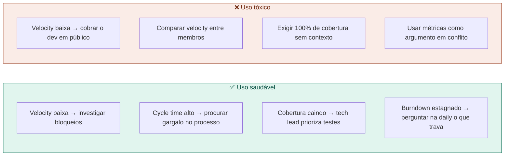

# 17 — Como Usar Métricas sem Criar Pressão Tóxica

tags: #métricas #liderança #cultura
links: [[14 - Velocity e Burndown]] | [[12 - Como Dar e Receber Feedback]]

---

## O paradoxo das métricas

> "Quando uma métrica se torna um objetivo, ela deixa de ser uma boa métrica." — Lei de Goodhart

Métricas existem para revelar problemas e orientar decisões — não para cobrar pessoas.

---

## Usos saudáveis vs tóxicos



---

## As três perguntas certas ao olhar uma métrica

1. **O que essa métrica está me dizendo sobre o processo — não sobre a pessoa?**
2. **O que eu preciso entender melhor antes de agir?**
3. **Que mudança no processo (não na pessoa) poderia melhorar essa métrica?**

---

## Métricas que NUNCA devem ser usadas individualmente

- Linhas de código escritas por pessoa
- Número de commits por dev
- Velocity individual (story points por pessoa)
- Número de bugs introduzidos por dev

Essas métricas incentivam comportamentos errados: commits pequenos só para inflar número, código verboso, medo de refatorar porque "conta como zero pontos".

---

## A conversa certa quando uma métrica está ruim

```
❌ "Por que sua velocity caiu tanto esse sprint?"

✅ "Percebi que a velocity do time caiu nas últimas duas semanas.
    Quero entender o que está acontecendo.
    O que vocês sentiram que foi diferente?"
```

---

## Próximas notas
- [[18 - Por que Onboarding Importa]]
- [[12 - Como Dar e Receber Feedback]]
