# 19 — Plano de Onboarding em 30 Dias

tags: #onboarding #plano #time
links: [[18 - Por que Onboarding Importa]] | [[20 - Documentação que o Time Realmente Lê]] | [[Template - Plano de Onboarding]]

---

## A estrutura dos 30 dias

O onboarding acontece em três fases com objetivos distintos.

```mermaid
flowchart LR
    subgraph S1["Dias 1–7 — Contexto"]
        A1[Entende o projeto]
        A2[Roda localmente]
        A3[Conhece o time]
        A4[Primeiro commit pequeno]
    end

    subgraph S2["Dias 8–21 — Contribuição"]
        B1[Resolve tasks reais com suporte]
        B2[Participa dos rituais]
        B3[Faz e recebe code review]
        B4[Entende a arquitetura]
    end

    subgraph S3["Dias 22–30 — Autonomia"]
        C1[Resolve tasks sem suporte]
        C2[Contribui na planning]
        C3[Pode ser buddy do próximo membro]
        C4[Retrospectiva do onboarding]
    end

    S1 --> S2 --> S3

    style S1 fill:#EEEDFE,stroke:#534AB7,color:#3C3489
    style S2 fill:#FAEEDA,stroke:#854F0B,color:#633806
    style S3 fill:#E1F5EE,stroke:#0F6E56,color:#085041
```



---

## Semana 1 — Contexto e ambiente

| Dia | Atividade | Responsável |
|---|---|---|
| Dia 1 | Apresentação do time, papéis e canais de comunicação | Coordenador |
| Dia 1 | Leitura do documento de visão do projeto | Novo membro |
| Dia 2 | Setup do ambiente local (README deve cobrir isso) | Buddy |
| Dia 3 | Walkthrough da arquitetura com o Tech Lead | Tech Lead |
| Dia 4 | Leitura das ADRs — decisões já tomadas | Novo membro |
| Dia 5 | Primeiro PR: task pequena escolhida pelo Tech Lead | Buddy + Tech Lead |

---

## Semana 2–3 — Contribuição guiada

- Assume tasks de complexidade crescente
- Participa de todas as dailies e plannings
- Tem check-in diário de 10 min com o buddy
- Recebe feedback de code review com explicação dos padrões

---

## Semana 4 — Autonomia

- Escolhe e estima suas próprias tasks na planning
- Buddy fica disponível mas não monitora ativamente
- Retrospectiva de onboarding: o que faltou? O que foi desnecessário?

---

## O papel do Buddy

O Buddy é um membro do time designado como referência para o novo membro. Não é tutor — é ponto de contato.

**Responsabilidades do Buddy:**
- Responder dúvidas rápidas antes de escalar para o Tech Lead
- Fazer o primeiro walkthrough do código junto
- Check-in diário nos primeiros 10 dias
- Compartilhar contexto não documentado ("aqui a gente não faz X porque...")

**Quem deve ser Buddy:** alguém que entrou há pouco tempo. Lembra como é não saber nada.

---

## Para projetos acadêmicos curtos (< 3 meses)

Comprima o plano para 2 semanas:

```
Dias 1–3:  Setup + contexto + primeiro commit
Dias 4–7:  Tasks guiadas com buddy
Dias 8–14: Autonomia crescente com check-ins
```

---

## Próxima nota
- [[20 - Documentação que o Time Realmente Lê]]
- [[Template - Plano de Onboarding]]
