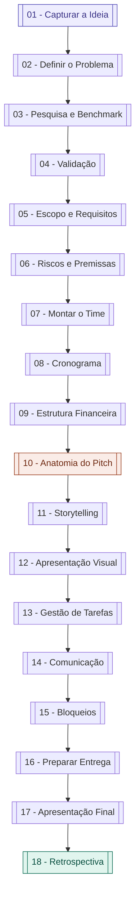
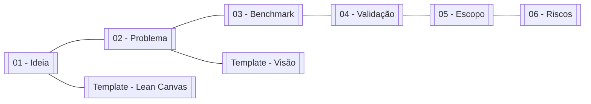
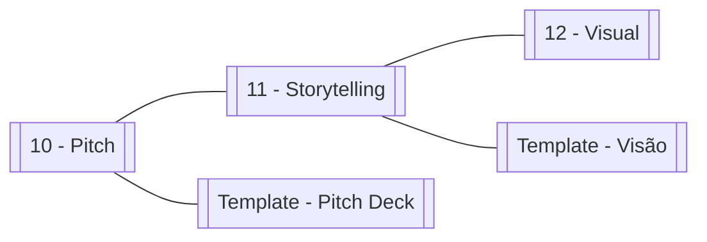
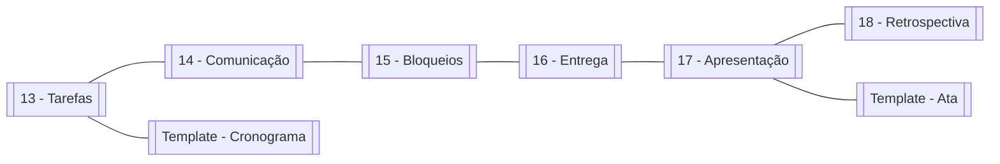

# 🔗 Mapa de Conexões — Grafo do Vault

tags: #moc #grafo
links: [[Estudos/Projetos/00-Maps/🗺️ Mapa Principal]]

---

> Esta nota existe para criar conexões explícitas entre todas as notas do vault.
> O Obsidian Graph View vai mostrar o grafo completo ao abrir esta nota.

---

## Fluxo principal — da ideia ao projeto entregue

---

## Mapa temático — Ideação e Validação

---

## Mapa temático — Pitch

---

## Mapa temático — Execução e Entrega

---

## Links para todos os nós

[[01 - Capturar e Refinar a Ideia]]
[[02 - Definir o Problema Real]]
[[03 - Pesquisa e Benchmark]]
[[04 - Validação com Pessoas Reais]]
[[05 - Definir Escopo e Requisitos]]
[[06 - Riscos e Premissas]]
[[07 - Montar o Time]]
[[08 - Planejamento e Cronograma]]
[[09 - Estrutura Financeira]]
[[10 - Anatomia de um Pitch]]
[[11 - Storytelling do Projeto]]
[[12 - Apresentação Visual]]
[[13 - Gestão de Tarefas e Sprints]]
[[14 - Comunicação no Time]]
[[15 - Lidando com Bloqueios]]
[[16 - Preparar a Entrega]]
[[17 - Apresentação Final]]
[[18 - Retrospectiva e Aprendizados]]
[[Template - Documento de Visão do Projeto]]
[[Template - Lean Canvas]]
[[Template - Cronograma]]
[[Template - Pitch Deck]]
[[Template - Ata de Reunião]]
