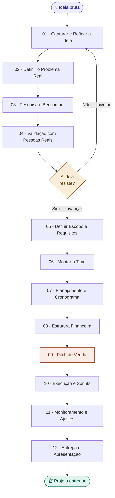
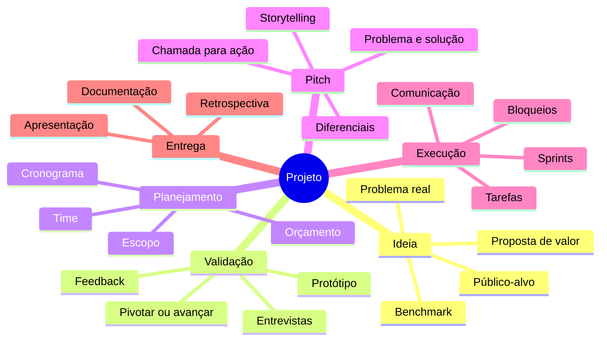

# 🗺️ Mapa Principal — Criação de Projetos

> Vault completo para sair de uma ideia bruta até um projeto estruturado, validado e apresentável.
> Funciona para projetos acadêmicos, empreendimentos, freelance ou iniciativas internas.

---

## Fluxo completo do projeto

---

## Índice de notas

### 💡 01 — Ideação
- [[01 - Capturar e Refinar a Ideia]]
- [[02 - Definir o Problema Real]]
- [[03 - Pesquisa e Benchmark]]

### 🔍 02 — Validação
- [[04 - Validação com Pessoas Reais]]
- [[05 - Definir Escopo e Requisitos]]
- [[06 - Riscos e Premissas]]

### 🗓️ 03 — Planejamento
- [[07 - Montar o Time]]
- [[08 - Planejamento e Cronograma]]
- [[09 - Estrutura Financeira]]

### 🎤 04 — Pitch
- [[10 - Anatomia de um Pitch]]
- [[11 - Storytelling do Projeto]]
- [[12 - Apresentação Visual]]

### ⚙️ 05 — Execução
- [[13 - Gestão de Tarefas e Sprints]]
- [[14 - Comunicação no Time]]
- [[15 - Lidando com Bloqueios]]

### 🏁 06 — Entrega
- [[16 - Preparar a Entrega]]
- [[17 - Apresentação Final]]
- [[18 - Retrospectiva e Aprendizados]]

### 📄 Templates
- [[Template - Documento de Visão do Projeto]]
- [[Template - Lean Canvas]]
- [[Template - Cronograma]]
- [[Template - Pitch Deck]]
- [[Template - Ata de Reunião]]

---

## Mapa de conceitos relacionados

