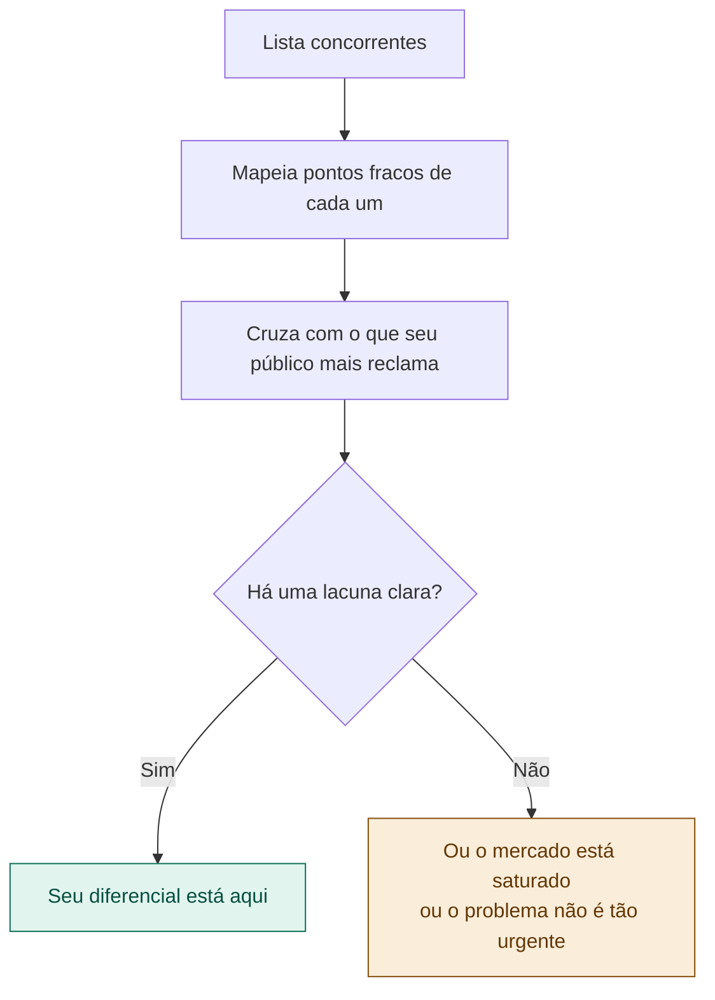

# 03 — Pesquisa e Benchmark

tags: #ideação #pesquisa #benchmark #mercado
links: [[02 - Definir o Problema Real]] | [[04 - Validação com Pessoas Reais]] | [[Estudos/Projetos/00-Maps/🗺️ Mapa Principal]]

---

## Por que pesquisar antes de construir

Antes de investir qualquer hora de trabalho, você precisa saber o que já existe. Dois cenários ruins para evitar:

1. **Reinventar a roda** — construir algo que já existe e funciona bem
2. **Ignorar o cemitério** — entrar num mercado cheio de projetos que falharam pelos mesmos motivos que o seu vai falhar

A pesquisa não é para desanimar. É para entrar no jogo com olhos abertos.

---

## Os 4 tipos de pesquisa

### 1. Pesquisa de concorrentes diretos
O que já resolve exatamente o mesmo problema para o mesmo público?

```
Como encontrar:
- Google: "[problema] solução", "[público] app", "[problema] ferramenta"
- Product Hunt (producthunt.com) — lançamentos de produtos
- App Store / Play Store — apps existentes
- GitHub — projetos open source
```

### 2. Pesquisa de concorrentes indiretos
O que as pessoas usam hoje para resolver o problema de forma imperfeita?

```
Exemplo para "organizar trabalho em grupo":
- Grupo de WhatsApp (comunicação improvisada)
- Planilha no Google Drive (mas ninguém atualiza)
- Notion compartilhado (mas é complexo demais)
- Trello (mas ninguém usa porque parece "coisa do trabalho")
```

### 3. Pesquisa de referências e inspirações
Projetos de outros contextos que resolvem problemas similares de forma interessante.

### 4. Pesquisa de mercado/contexto
Dados que confirmam que o problema é real e tem escala.

```
Onde buscar dados:
- IBGE, Sebrae, FGV (Brasil)
- Statista, Gartner (global)
- Relatórios de setor
- Artigos acadêmicos (Google Scholar)
- Notícias recentes sobre o tema
```

---

## Como fazer um benchmark

Para cada concorrente ou referência, mapeie:

| Produto | O que faz | Para quem | Pontos fortes | Pontos fracos | Preço |
|---|---|---|---|---|---|
| [nome] | [função principal] | [público] | [o que fazem bem] | [onde erram] | [grátis/pago] |

**Exemplo — benchmark de organizadores de grupo:**

| Produto | O que faz | Para quem | Pontos fortes | Pontos fracos | Preço |
|---|---|---|---|---|---|
| Trello | Kanban de tarefas | Times de trabalho | Visual, flexível | Complexo, intimida iniciantes | Freemium |
| Notion | Workspace completo | Profissionais | Tudo em um lugar | Curva de aprendizado enorme | Freemium |
| WhatsApp | Comunicação | Todo mundo | Todo mundo já usa | Nada é formal ou registrado | Grátis |
| Google Sheets | Planilhas | Qualquer pessoa | Colaborativo, simples | Não notifica, sem gestão real | Grátis |

---

## Analisando as lacunas

Depois do benchmark, identifique o espaço que ninguém ocupa bem:



---

## A análise SWOT simplificada

Para projetos acadêmicos e iniciantes, o SWOT é um atalho útil para organizar o que você aprendeu:

| | Interno (seu projeto) | Externo (o mercado) |
|---|---|---|
| **Positivo** | **Forças** — o que você tem de diferencial | **Oportunidades** — brechas no mercado |
| **Negativo** | **Fraquezas** — o que ainda falta ou limita | **Ameaças** — concorrentes, riscos |

```
Exemplo — projeto de organização de grupos acadêmicos:

Forças:        Conheço o público (sou o público), custo zero de distribuição (FIAP)
Fraquezas:     Time pequeno, pouco tempo, nunca lançamos nada antes
Oportunidades: Todas as ferramentas existentes são complexas demais para o contexto acadêmico
Ameaças:       WhatsApp é difícil de deslocar, professores podem adotar outra ferramenta
```

---

## O que fazer se já existir algo muito parecido

Três caminhos possíveis:

1. **Nichar ainda mais** — a concorrência atende o mercado geral, você atende um nicho específico com mais profundidade
2. **Mudar o canal** — a solução existe mas não chega ao seu público. Você distribui de forma diferente.
3. **Pivotar** — o problema foi bem resolvido. Procure um problema adjacente que não foi.

> Copiar não é um crime — mas não é projeto. O que transforma uma pesquisa em projeto é a angulação única que você traz.

---

## Próximas notas
- [[04 - Validação com Pessoas Reais]] — sair do computador e falar com o público
- [[05 - Definir Escopo e Requisitos]] — transformar a ideia em lista de entregas
