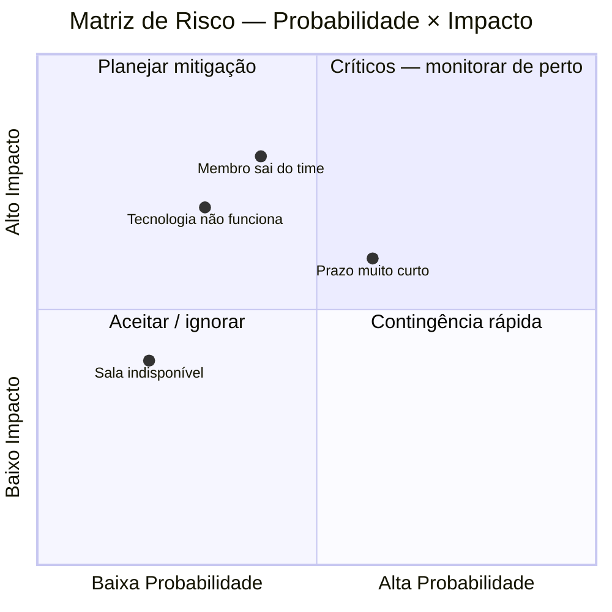

# 06 — Riscos e Premissas

tags: #validação #riscos #planejamento #projeto
links: [[05 - Definir Escopo e Requisitos]] | [[07 - Montar o Time]] | [[Estudos/Projetos/00-Maps/🗺️ Mapa Principal]]

---

## Por que pensar em riscos antes de começar

A maioria dos times evita essa conversa porque parece pessimismo. Na verdade é o contrário — antecipar riscos é o que separa times que entregam de times que são surpreendidos.

> Risco não gerenciado não desaparece. Ele aparece no pior momento possível.

---

## A diferença entre risco e premissa

| Conceito | Definição | Exemplo |
|---|---|---|
| **Risco** | Algo que *pode* acontecer e prejudicar o projeto | "Um membro pode sair do time no meio" |
| **Premissa** | Algo que você *assume* ser verdade para o projeto funcionar | "A faculdade vai ceder a sala para o evento" |

Premissas são riscos disfarçados. Se uma premissa for falsa, o projeto quebra. Liste todas e valide as críticas cedo.

---

## Como mapear riscos

Para cada risco identificado, avalie duas dimensões:

- **Probabilidade** — chance de acontecer (Baixa / Média / Alta)
- **Impacto** — efeito se acontecer (Baixo / Médio / Alto)



---

## Tabela de riscos — exemplo preenchido

| Risco | Probabilidade | Impacto | Mitigação | Plano B |
|---|---|---|---|---|
| Membro do time abandona o projeto | Média | Alto | Documentar tudo desde o início, dividir conhecimento | Redistribuir tarefas, reduzir escopo |
| Prazo final conflita com provas | Alta | Médio | Mapear calendário acadêmico no início | Antecipar entrega ou negociar prazo com professor |
| Tecnologia escolhida não funciona como esperado | Baixa | Alto | Fazer prova de conceito técnica na semana 1 | Trocar ferramenta por opção mais simples |
| Usuários não aderem ao projeto | Média | Alto | Validar com usuários reais antes de construir | Pivotar funcionalidades com base no feedback |
| Reuniões de alinhamento não acontecem | Alta | Médio | Definir horário fixo semanal desde o início | Comunicação assíncrona via ferramenta combinada |
| Recurso financeiro insuficiente | Baixa | Alto | Mapear todos os custos antes de começar | Cortar funcionalidades pagas, usar alternativas gratuitas |

---

## Como lidar com cada tipo de risco

```
Probabilidade Alta + Impacto Alto   → Mitigar ativamente (evite que aconteça)
Probabilidade Alta + Impacto Baixo  → Monitorar e ter plano rápido
Probabilidade Baixa + Impacto Alto  → Ter plano de contingência pronto
Probabilidade Baixa + Impacto Baixo → Aceitar e seguir em frente
```

---

## Lista de premissas críticas para validar

Antes de avançar, confirme explicitamente cada uma:

```
[ ] Os membros do time têm disponibilidade real de X horas por semana
[ ] A ferramenta/tecnologia escolhida é gratuita ou está no orçamento
[ ] O espaço/recurso necessário está disponível para uso
[ ] O professor/cliente/sponsor aprovou o escopo
[ ] As pessoas do público-alvo realmente têm o problema (validação feita)
[ ] O cronograma é factível dado o calendário acadêmico/profissional real
```

> Se qualquer premissa for "achamos que sim mas não confirmamos", essa é sua prioridade número 1 antes de avançar.

---

## Próximas notas
- [[07 - Montar o Time]] — definir quem faz o quê
- [[08 - Planejamento e Cronograma]] — transformar escopo em datas
