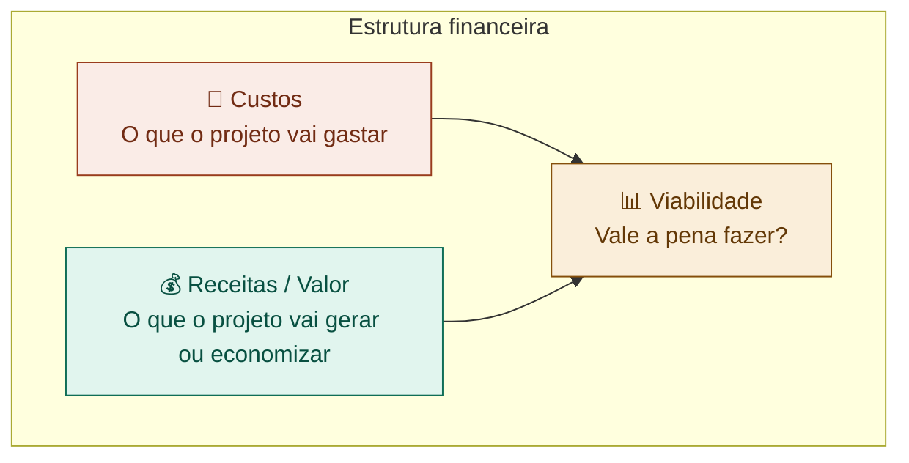

# 09 — Estrutura Financeira do Projeto

tags: #planejamento #financeiro #orçamento #custos
links: [[08 - Planejamento e Cronograma]] | [[10 - Anatomia de um Pitch]] | [[Estudos/Projetos/00-Maps/🗺️ Mapa Principal]]

---

## Por que todo projeto tem uma dimensão financeira

Mesmo projetos acadêmicos gratuitos têm custos — de tempo, de ferramentas, de materiais. Mapear isso antes de começar evita surpresas desagradáveis no meio do caminho.

Para projetos com intenção comercial ou empreendedora, a estrutura financeira é ainda mais crítica — bancas e investidores sempre perguntam sobre números.

---

## Os três blocos financeiros de qualquer projeto



---

## Mapeando os custos

### Tipos de custo

| Tipo | O que é | Exemplos |
|---|---|---|
| **Fixo** | Não muda com o volume | Domínio, plano de ferramenta, aluguel de espaço |
| **Variável** | Varia com uso ou escala | Servidores por acesso, materiais por unidade |
| **Único** | Acontece uma vez | Compra de equipamento, desenvolvimento inicial |
| **Recorrente** | Acontece todo mês/ano | Assinaturas, hospedagem, licenças |
| **Oculto** | Frequentemente esquecido | Tempo da equipe, deslocamento, revisões |

### Categorias comuns de custo

```
📦 INFRAESTRUTURA E FERRAMENTAS
  - Hospedagem (Vercel, Railway, AWS...)
  - Domínio (.com.br ≈ R$ 40/ano)
  - Ferramentas (Figma, Notion, Trello...)
  - Serviços de e-mail, SMS, mapas...

👥 PESSOAS
  - Horas do time (mesmo que voluntário, tem custo de oportunidade)
  - Consultores externos
  - Designer freelance, músico, fotógrafo...

📣 COMUNICAÇÃO E MARKETING
  - Impressão de materiais
  - Patrocínio de posts
  - Criação de identidade visual

🎪 OPERAÇÃO E EVENTOS
  - Aluguel de espaço
  - Coffee break, materiais físicos
  - Transporte e logística

🔧 DESENVOLVIMENTO E PRODUÇÃO
  - Materiais de prototipagem
  - Impressão 3D, insumos
  - Licenças de software
```

---

## Modelo de orçamento

```markdown
## Orçamento — [Nome do Projeto]

### Custos únicos (investimento inicial)
| Item | Quantidade | Valor unitário | Total |
|------|-----------|----------------|-------|
| Domínio | 1 | R$ 40,00 | R$ 40,00 |
| Criação de logo | 1 | R$ 0 (Figma gratuito) | R$ 0 |
| [item] | | | |
**Subtotal único: R$ ___**

### Custos recorrentes (por mês)
| Item | Valor/mês | Meses do projeto | Total |
|------|-----------|-----------------|-------|
| Hospedagem Railway | R$ 0 (tier gratuito) | 3 | R$ 0 |
| [item] | | | |
**Subtotal recorrente: R$ ___**

### Total geral: R$ ___
### Reserva de contingência (15%): R$ ___
### TOTAL COM RESERVA: R$ ___

### Fonte dos recursos
| Fonte | Valor |
|-------|-------|
| Recursos próprios do time | R$ |
| Patrocínio / edital | R$ |
| Total disponível | R$ |
```

---

## Para projetos com modelo de negócio — projeção de receita

Se o projeto tem intenção de gerar receita, estime:

### Modelos de receita mais comuns

| Modelo | Como funciona | Exemplo |
|---|---|---|
| **Venda direta** | Cobra uma vez pelo produto/serviço | App pago na loja |
| **Assinatura (SaaS)** | Cobra mensalmente pelo acesso | Spotify, Notion |
| **Freemium** | Grátis com funcionalidades extras pagas | LinkedIn |
| **Marketplace** | Comissão sobre transações entre partes | AirBnb, iFood |
| **Publicidade** | Receita de anunciantes | Instagram |
| **Serviço** | Venda de horas ou projetos | Consultoria, agência |

### Cálculo básico de viabilidade

```
TAM (Mercado total disponível):
  "Quantas pessoas têm esse problema no Brasil?"

SAM (Mercado endereçável):
  "Dessas, quantas eu posso alcançar com meus recursos?"

SOM (Mercado que consigo capturar):
  "No primeiro ano, qual % realista eu conseguiria?"

Projeção de receita (ano 1):
  SOM × ticket médio mensal × 12 meses = R$ ___

Ponto de equilíbrio (break-even):
  Quando a receita cobre os custos totais?
```

**Exemplo simplificado:**
```
TAM:  2 milhões de universitários no Brasil
SAM:  200.000 (alunos de tech e negócios com smartphone)
SOM:  2.000 (meta do primeiro ano = 1%)

Modelo: freemium, plano Pro R$ 9,90/mês
Conversão esperada: 10% dos usuários vão para Pro

Usuários pagantes: 200
Receita mensal: 200 × R$ 9,90 = R$ 1.980
Receita anual: R$ 23.760
```

---

## Ferramentas gratuitas para projetos acadêmicos

| Necessidade | Opção gratuita |
|---|---|
| Hospedagem web | Vercel, Railway (tier free), Render |
| Banco de dados | Supabase (free tier), Railway |
| Design | Figma (gratuito para estudantes) |
| Gestão | Trello, Notion, GitHub Projects |
| Comunicação | Discord, WhatsApp |
| Documentos | Google Docs / Drive |
| E-mail transacional | Resend (100/dia grátis) |

---

## Próximas notas
- [[10 - Anatomia de um Pitch]] — como apresentar o projeto para bancas e investidores
