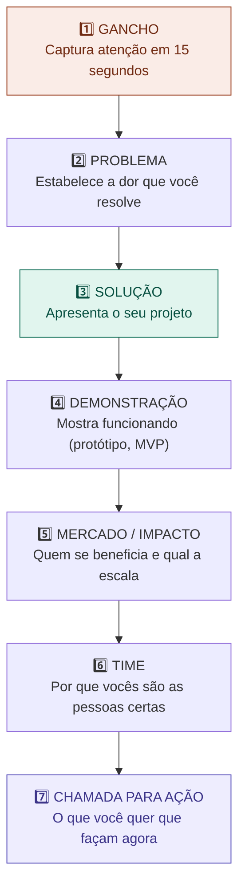

# 10 — Anatomia de um Pitch

tags: #pitch #apresentação #venda #projeto
links: [[09 - Estrutura Financeira]] | [[11 - Storytelling do Projeto]] | [[12 - Apresentação Visual]] | [[Estudos/Projetos/00-Maps/🗺️ Mapa Principal]]

---

## O que é um pitch

Um **pitch** é uma apresentação curta e objetiva do seu projeto, feita para convencer alguém — uma banca, um investidor, um cliente, um professor — de que o projeto vale o tempo, o dinheiro ou a atenção deles.

A palavra vem de "elevator pitch" — a ideia de que você tem o tempo de um elevador (30 a 120 segundos) para convencer alguém.

> Um pitch não é uma apresentação completa de tudo que você fez. É a versão mais persuasiva da essência do seu projeto.

---

## Os tipos de pitch

| Tipo | Duração | Contexto |
|---|---|---|
| **Elevator pitch** | 30–60 segundos | Corredor, networking, evento |
| **Pitch de 3 minutos** | 3 min | Competições acadêmicas, banca rápida |
| **Pitch completo** | 5–10 min | Apresentação formal, banca de TCC/PI |
| **Pitch de vendas** | 15–30 min | Reunião com cliente, investidor |

---

## A estrutura clássica — o arco dos 7 blocos



---

## Bloco por bloco — o que dizer em cada um

### 1. Gancho (15 segundos)

Comece com algo que force a pessoa a prestar atenção. Pode ser uma estatística chocante, uma pergunta retórica ou uma história curta.

```
❌ "Bom dia, vamos apresentar nosso projeto chamado X que visa..."
✅ "Você sabia que 70% dos trabalhos em grupo na faculdade são feitos por 30% do time?"
✅ "Isso já aconteceu com vocês: a semana de entrega chega e metade do grupo sumiu."
```

### 2. Problema (30–60 segundos)

Descreva o problema de forma que a audiência o reconheça como real e importante. Use dados se possível.

```
O que incluir:
- Quem sofre (o público específico)
- Como sofre (o que acontece na prática)
- Por que importa (qual é o custo da não-solução)
- Dado ou evidência que valide a escala
```

### 3. Solução (30–60 segundos)

Apresente o projeto de forma simples e direta. Uma frase poderosa, seguida de detalhe.

```
Formato: "[Nome] é um(a) [tipo de solução] que [verbo + benefício]."

Exemplo: "O Taskio é uma plataforma de gestão de grupos que distribui tarefas automaticamente
e envia lembretes sem que ninguém precise ser o 'chato' do grupo."
```

### 4. Demonstração (1–2 minutos)

Mostre, não explique. Uma tela funcionando vale mais do que 10 slides descrevendo funcionalidades.

```
✅ Protótipo clicável no Figma
✅ MVP funcionando ao vivo
✅ Vídeo de demonstração de 60 segundos
✅ Storyboard animado das principais funcionalidades

❌ Lista de funcionalidades em bullet points
❌ Diagrama técnico de arquitetura (banca de negócios não se importa)
```

### 5. Mercado / Impacto (30–60 segundos)

Prove que o problema tem escala suficiente para justificar o projeto.

```
Para projetos acadêmicos: "Quantas pessoas se beneficiariam?"
Para projetos de negócio:  TAM / SAM / SOM + projeção de receita
Para projetos sociais:     Número de pessoas impactadas + indicadores de mudança
```

### 6. Time (15–30 segundos)

Por que vocês são as pessoas certas para fazer esse projeto? Destaque experiências relevantes, não o currículo completo.

```
✅ "Eu vivi esse problema por 3 semestres. Maria tem 2 anos de experiência
    em desenvolvimento web e João já fez 4 projetos entregues no prazo."

❌ "Somos alunos do 3º período do curso de ADS com interesse em tecnologia."
```

### 7. Chamada para ação (15 segundos)

O que você quer que a audiência faça agora? Seja específico.

```
Para banca acadêmica:   "Gostaríamos da aprovação para avançar para a fase de testes."
Para investidor:        "Estamos levantando R$ 30.000 para desenvolver o MVP. Podemos agendar?"
Para cliente:           "Posso enviar uma proposta detalhada ainda esta semana?"
Para professor:         "Pedimos nota máxima com base nos critérios X, Y e Z que cumprimos."
```

---

## Os erros mais comuns em pitches

| Erro | Por que é ruim | Como corrigir |
|---|---|---|
| Começar com "Bom dia, nosso projeto é..." | Não cria tensão, a atenção cai | Comece com gancho |
| Descrever funcionalidades, não benefícios | Banca quer impacto, não features | "Isso permite que o usuário..." |
| Slide com parágrafos inteiros | Ninguém lê, você compete com o slide | Máximo 5 palavras por bullet |
| Não mostrar o produto | "Acredite em nós" não convence | Sempre demonstre algo visual |
| Ignorar perguntas difíceis | Passa ar de que não sabe o projeto | Prepare-se para os 10 ataques comuns |
| Pitch muito longo | Perde atenção, passa insegurança | Ensaie com cronômetro |
| Time falando junto sem coordenação | Parece desorganizado | Defina quem fala o quê com antecedência |

---

## As 10 perguntas que sempre aparecem

Prepare respostas para todas antes da apresentação:

1. "Por que isso é diferente do que já existe?"
2. "Vocês testaram com usuários reais?"
3. "Qual é o custo de implementação?"
4. "Como vocês planejam crescer / escalar?"
5. "O que acontece se um concorrente grande copiar a ideia?"
6. "Qual é o maior risco do projeto?"
7. "Por que vocês e não outra pessoa?"
8. "Como vocês garantem que as pessoas vão adotar?"
9. "O que foi feito no prazo X que vocês tinham?"
10. "O que você mudaria se pudesse começar do zero?"

---

## Próximas notas
- [[11 - Storytelling do Projeto]] — como contar a história que move pessoas
- [[12 - Apresentação Visual]] — slides que ajudam em vez de atrapalhar
