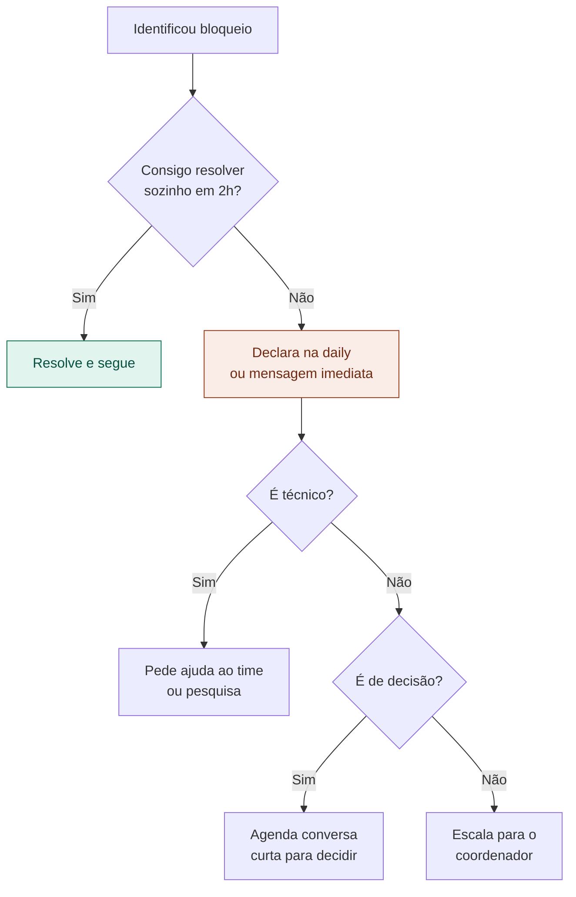

# 15 — Lidando com Bloqueios

tags: #execução #bloqueios #problemas #projeto
links: [[14 - Comunicação no Time]] | [[16 - Preparar a Entrega]] | [[Estudos/Projetos/00-Maps/🗺️ Mapa Principal]]

---

## O que é um bloqueio

Um bloqueio é qualquer coisa que impede uma tarefa de avançar. Pode ser técnico ("não sei como implementar X"), de dependência ("preciso que Maria termine antes de continuar"), de recurso ("não tenho acesso à ferramenta") ou de decisão ("não sei qual caminho tomar").

> Bloqueio não declarado é mais danoso do que bloqueio declarado. A daily existe exatamente para fazer bloqueios surfaçarem cedo.

---

## O protocolo de bloqueio



---

## Os bloqueios mais comuns e como resolver

| Bloqueio | Causa raiz | Solução |
|---|---|---|
| "Não sei como fazer X" | Falta de conhecimento técnico | Par programming, tutorial, pedir ajuda |
| "Estou esperando Y terminar" | Dependência mal mapeada | Revisar sequência de tarefas na próxima sprint |
| "Não sei o que o cliente/professor quer" | Requisito ambíguo | Reunião rápida de esclarecimento — não adivinhe |
| "A ferramenta não funciona" | Problema técnico | Prova de conceito mais cedo no projeto |
| "O escopo mudou" | Scope creep | Voltar ao documento de escopo, negociar formalmente |
| "Não tem tempo" | Subestimação ou sobrecarga | Reduzir escopo, redistribuir tarefas |

---

## Quando o bloqueio vira decisão de pivô

Se um bloqueio é recorrente ou tem impacto alto no projeto, pode ser sinal de que uma premissa central está errada. Nesse caso:

```
1. Para tudo brevemente
2. Reúne o time
3. Identifica qual premissa falhou
4. Decide: ajusta, reduz escopo ou pivota
5. Documenta a decisão
6. Atualiza o plano
```

---

## Próximas notas
- [[16 - Preparar a Entrega]] — chegou a hora de entregar
