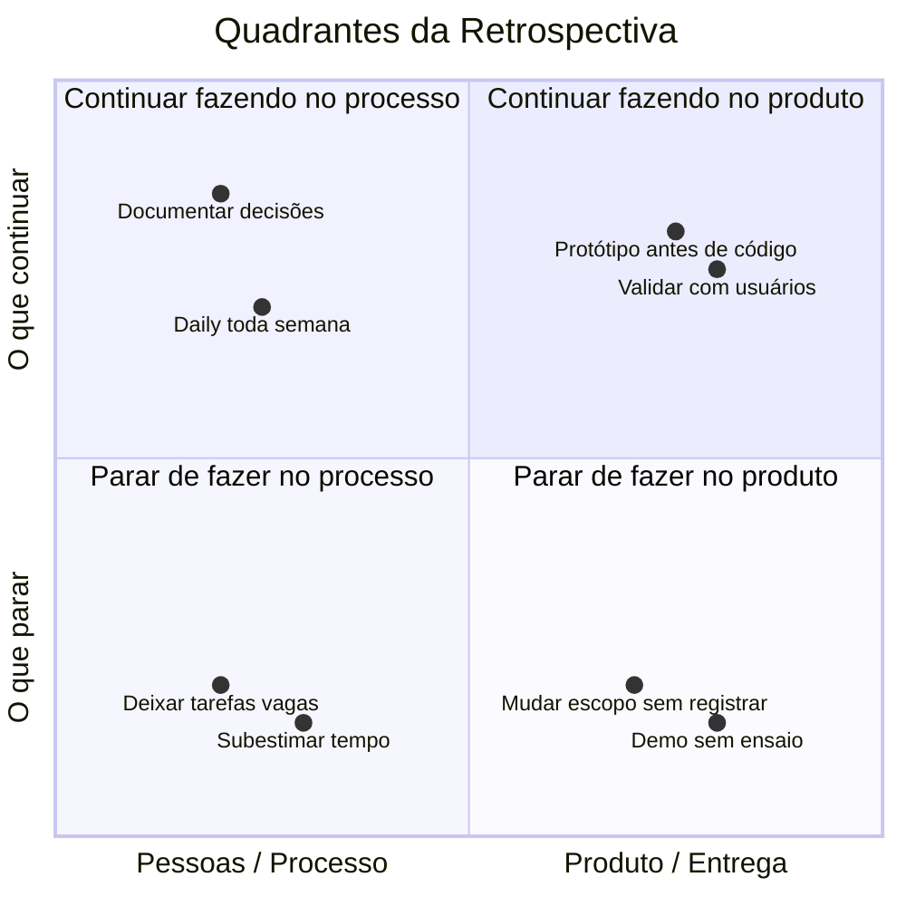
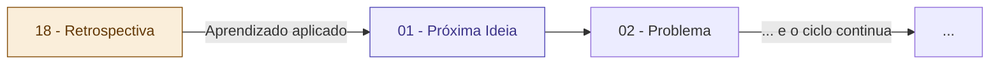

# 18 — Retrospectiva e Aprendizados

tags: #entrega #retrospectiva #aprendizado #melhoria
links: [[17 - Apresentação Final]] | [[01 - Capturar e Refinar a Ideia]] | [[Estudos/Projetos/00-Maps/🗺️ Mapa Principal]]

---

## Por que a retrospectiva é o passo que todo mundo pula

Depois de entregar, a reação natural é querer descansar e esquecer. É exatamente por isso que a maioria dos times repete os mesmos erros projeto após projeto.

A retrospectiva é o que transforma experiência em aprendizado real. Sem ela, você só acumula tempo — não maturidade.

> "Experiência não é o que acontece com você. É o que você faz com o que acontece." — Aldous Huxley

---

## Quando fazer a retrospectiva

Idealmente, **dentro de 3 dias após a entrega** — quando tudo ainda está fresco na memória. Não espere "um dia quando der" — esse dia não chega.

Duração: 45–60 minutos.

---

## A estrutura da retrospectiva — os 4 quadrantes



---

## As 4 perguntas da retrospectiva

Para cada pergunta, todos escrevem no papel ou numa ferramenta colaborativa antes de discutir — evita que as vozes mais altas dominem.

### 1. O que funcionou bem?
O que definitivamente vamos repetir no próximo projeto?

```
Exemplos de resposta:
- "As dailies de 15 minutos foram ótimas — mantiveram o time alinhado"
- "Usar o Figma para prototipar antes de codificar salvou muitas horas"
- "O documento de escopo evitou discussões sobre o que estava ou não no projeto"
```

### 2. O que não funcionou?
O que causou dor, atraso ou conflito?

```
Exemplos:
- "Estimamos muito otimisticamente — subestimamos metade das tarefas"
- "As decisões eram tomadas em conversa informal e ninguém lembrava depois"
- "A demo funcionava no nosso computador mas travou na apresentação"
```

### 3. O que aprendemos?
Insights sobre o domínio, sobre tecnologia, sobre trabalho em grupo.

```
Exemplos:
- "Aprendi que validar com 5 pessoas antes de construir teria mudado o produto inteiro"
- "Aprendi que conflito de merge no Git acontece quando duas pessoas editam o mesmo arquivo"
- "Aprendi que a banca pergunta muito sobre os usuários — precisamos entrevistar mais"
```

### 4. O que faríamos diferente?
Se começássemos esse mesmo projeto hoje, o que mudaria?

```
Exemplos:
- "Definiríamos um documento de escopo assinado logo na semana 1"
- "Faríamos a demo ao vivo 3 dias antes para testar no ambiente real"
- "Ensaiaríamos o pitch pelo menos 3 vezes antes do dia"
```

---

## O documento de lições aprendidas

Depois da retrospectiva, registre as principais conclusões em um arquivo simples:

```markdown
## Lições Aprendidas — [Nome do Projeto] — [Data]

### O que definitivamente vamos repetir
- [lição 1]
- [lição 2]

### O que vamos mudar
| O que não funcionou | O que faremos diferente |
|---------------------|-------------------------|
| [problema] | [mudança] |

### Aprendizados individuais
- [Nome]: [o que aprendeu]
- [Nome]: [o que aprendeu]

### Nota de autopavaliação do time (1–10)
- Entrega do produto: ___
- Processo de trabalho: ___
- Comunicação interna: ___
- Apresentação: ___
```

---

## O ciclo se fecha — e começa de novo



Cada projeto que você termina te deixa mais preparado para o próximo. O aprendizado composto de quem faz projetos consistentemente é o maior diferencial de um profissional de tecnologia.

---

## Próximas notas
- [[01 - Capturar e Refinar a Ideia]] — o ciclo recomeça
- [[Template - Documento de Visão do Projeto]] — templates para o próximo projeto
