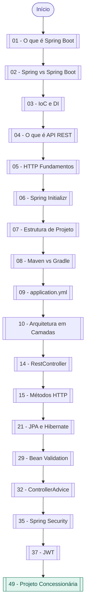

# 🔗 Mapa de Conexões — Spring Boot Vault

tags: #moc #grafo
links: [[Estudos/SpringBoot/00-Maps/🗺️ Mapa Principal]]

---

> Esta nota cria conexões explícitas entre todas as notas do vault para o Grafo do Obsidian.

---

## Fluxo: do zero ao primeiro endpoint

---

## Links para todos os nós

### Módulo 01 — Fundamentos
[[01 - O que é Spring Boot]]
[[02 - Spring vs Spring Boot vs Spring Framework]]
[[03 - IoC e Injeção de Dependência]]
[[04 - O que é uma API REST]]
[[05 - HTTP Fundamentos]]

### Módulo 02 — Setup
[[06 - Criando Projeto com Spring Initializr]]
[[07 - Estrutura de Projeto Spring Boot]]
[[08 - Maven vs Gradle]]
[[09 - application.properties e application.yml]]

### Módulo 03 — Arquitetura
[[10 - Arquitetura em Camadas]]
[[11 - Clean Architecture no Spring Boot]]
[[12 - Controller Service Repository Domain DTO]]
[[13 - Organização de Pacotes e Boas Práticas]]

### Módulo 04 — Controllers
[[14 - RestController e RequestMapping]]
[[15 - Métodos HTTP GET POST PUT DELETE]]
[[16 - PathVariable e RequestParam]]
[[17 - RequestBody e ResponseEntity]]

### Módulo 05 — DTOs
[[18 - O que são DTOs e Por que Usar]]
[[19 - Request vs Response DTO]]
[[20 - Mapeamento Manual e MapStruct]]

### Módulo 06 — Persistência
[[21 - JPA e Hibernate Fundamentos]]
[[22 - Entidades e Anotações JPA]]
[[23 - Relacionamentos OneToMany ManyToOne ManyToMany]]
[[24 - JpaRepository e Query Methods]]
[[25 - JPQL e @Query]]

### Módulo 07 — Banco
[[26 - Configuração de Banco Relacional]]
[[27 - Flyway Migrations]]
[[28 - Modelagem de Dados com JPA]]

### Módulo 08 — Validação
[[29 - Bean Validation]]
[[30 - Anotações de Validação]]
[[31 - Tratamento de Erros de Validação]]

### Módulo 09 — Exceções
[[32 - ControllerAdvice e ExceptionHandler]]
[[33 - Exceções Customizadas]]
[[34 - Padrão de Resposta de Erro]]

### Módulo 10 — Segurança
[[35 - Introdução ao Spring Security]]
[[36 - Autenticação vs Autorização]]
[[37 - JWT Conceito e Implementação]]
[[38 - Filtros de Segurança]]

### Módulo 11 — Boas Práticas
[[39 - Padrão REST Completo]]
[[40 - Versionamento de API]]
[[41 - Paginação e Ordenação]]
[[42 - Filtros e Idempotência]]

### Módulo 12 — Testes
[[43 - Testes Unitários com JUnit e Mockito]]
[[44 - Testes de Integração Spring Boot Test]]

### Módulo 13 — Documentação
[[45 - Swagger e OpenAPI]]

### Módulo 14 — Performance
[[46 - Lazy vs Eager Loading]]
[[47 - Problema N+1]]
[[48 - Cache com Spring]]

### Módulo 15 — Projeto Completo
[[49 - Projeto Concessionária - Visão Geral]]
[[50 - Projeto Concessionária - Entidades]]
[[51 - Projeto Concessionária - Controllers e DTOs]]
[[52 - Projeto Concessionária - Segurança e JWT]]
[[53 - Projeto Concessionária - Paginação e Docs]]

### Módulo 16 — Extras
[[54 - Logs com SLF4J]]
[[55 - Profiles dev e prod]]
[[56 - Docker para Spring Boot]]
[[57 - Deploy]]
