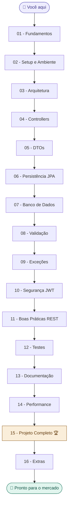

# 🗺️ Mapa Principal — Spring Boot & APIs REST com Java

tags: #moc #springboot #java
links: [[Estudos/SpringBoot/00-Maps/🔗 Mapa de Conexões]]

> Apostila completa de Spring Boot para desenvolvimento de APIs REST.
> Estudo progressivo: fundamentos → mercado de trabalho.
> Siga o fluxo numerado ou navegue pelos mapas temáticos.

---

## Fluxo de estudo recomendado

---

## 📂 Índice Completo

### 🔷 01 — Fundamentos
- [[01 - O que é Spring Boot]]
- [[02 - Spring vs Spring Boot vs Spring Framework]]
- [[03 - IoC e Injeção de Dependência]]
- [[04 - O que é uma API REST]]
- [[05 - HTTP Fundamentos]]

### 🔷 02 — Setup e Ambiente
- [[06 - Criando Projeto com Spring Initializr]]
- [[07 - Estrutura de Projeto Spring Boot]]
- [[08 - Maven vs Gradle]]
- [[09 - application.properties e application.yml]]

### 🔷 03 — Arquitetura
- [[10 - Arquitetura em Camadas]]
- [[11 - Clean Architecture no Spring Boot]]
- [[12 - Controller Service Repository Domain DTO]]
- [[13 - Organização de Pacotes e Boas Práticas]]

### 🔷 04 — Controllers
- [[14 - RestController e RequestMapping]]
- [[15 - Métodos HTTP GET POST PUT DELETE]]
- [[16 - PathVariable e RequestParam]]
- [[17 - RequestBody e ResponseEntity]]

### 🔷 05 — DTOs
- [[18 - O que são DTOs e Por que Usar]]
- [[19 - Request vs Response DTO]]
- [[20 - Mapeamento Manual e MapStruct]]

### 🔷 06 — Persistência
- [[21 - JPA e Hibernate Fundamentos]]
- [[22 - Entidades e Anotações JPA]]
- [[23 - Relacionamentos OneToMany ManyToOne ManyToMany]]
- [[24 - JpaRepository e Query Methods]]
- [[25 - JPQL e @Query]]

### 🔷 07 — Banco de Dados
- [[26 - Configuração de Banco Relacional]]
- [[27 - Flyway Migrations]]
- [[28 - Modelagem de Dados com JPA]]

### 🔷 08 — Validação
- [[29 - Bean Validation]]
- [[30 - Anotações de Validação]]
- [[31 - Tratamento de Erros de Validação]]

### 🔷 09 — Exceções
- [[32 - ControllerAdvice e ExceptionHandler]]
- [[33 - Exceções Customizadas]]
- [[34 - Padrão de Resposta de Erro]]

### 🔷 10 — Segurança
- [[35 - Introdução ao Spring Security]]
- [[36 - Autenticação vs Autorização]]
- [[37 - JWT Conceito e Implementação]]
- [[38 - Filtros de Segurança]]

### 🔷 11 — Boas Práticas REST
- [[39 - Padrão REST Completo]]
- [[40 - Versionamento de API]]
- [[41 - Paginação e Ordenação]]
- [[42 - Filtros e Idempotência]]

### 🔷 12 — Testes
- [[43 - Testes Unitários com JUnit e Mockito]]
- [[44 - Testes de Integração Spring Boot Test]]

### 🔷 13 — Documentação
- [[45 - Swagger e OpenAPI]]

### 🔷 14 — Performance
- [[46 - Lazy vs Eager Loading]]
- [[47 - Problema N+1]]
- [[48 - Cache com Spring]]

### 🔷 15 — Projeto Completo
- [[49 - Projeto Concessionária - Visão Geral]]
- [[50 - Projeto Concessionária - Entidades]]
- [[51 - Projeto Concessionária - Controllers e DTOs]]
- [[52 - Projeto Concessionária - Segurança e JWT]]
- [[53 - Projeto Concessionária - Paginação e Docs]]

### 🔷 16 — Extras
- [[54 - Logs com SLF4J]]
- [[55 - Profiles dev e prod]]
- [[56 - Docker para Spring Boot]]
- [[57 - Deploy]]

---

## 💡 Como usar este vault

1. **Estudo linear:** siga a numeração de 01 a 57
2. **Revisão temática:** use os mapas de conexões por área
3. **Referência rápida:** use tags para encontrar exemplos de código
4. **Projeto:** a partir da nota 49, construa o projeto completo

> Tags disponíveis: #springboot #java #jpa #rest #segurança #testes #performance
