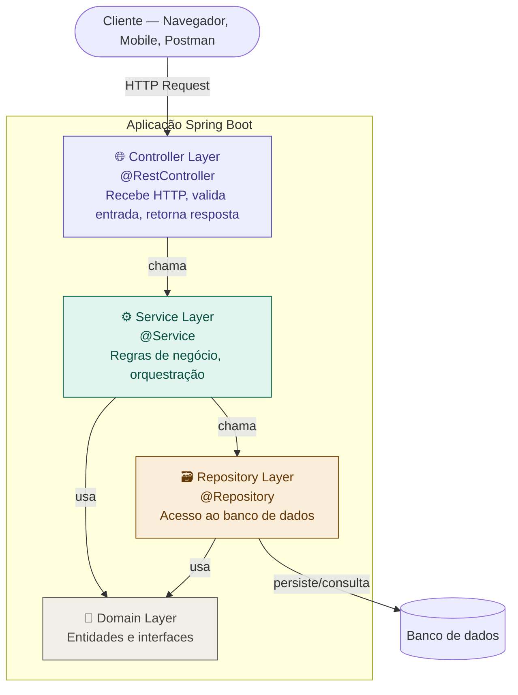

# 10 — Arquitetura em Camadas

tags: #springboot #arquitetura #camadas
links: [[11 - Clean Architecture no Spring Boot]] | [[12 - Controller Service Repository Domain DTO]] | [[Estudos/Projetos/00-Maps/🗺️ Mapa Principal]]

---

## O que é arquitetura em camadas

A arquitetura em camadas (Layered Architecture) organiza o código em **grupos de responsabilidade bem definidos**, onde cada camada tem um único papel e se comunica apenas com a camada imediatamente abaixo.

É o padrão mais adotado no mercado Spring Boot — você vai encontrá-lo em praticamente toda empresa que usa Java.

---

## As camadas no contexto Spring Boot



---

## Responsabilidade de cada camada

### 🌐 Controller (Camada Web)
- Recebe a requisição HTTP
- Extrai dados da requisição (path variables, query params, body)
- Converte DTO de entrada para objetos internos
- **Delega** para o Service (nunca processa lógica de negócio aqui)
- Converte o resultado para DTO de saída
- Retorna a resposta HTTP com o status correto

```java
@RestController
@RequestMapping("/clientes")
public class ClienteController {

    private final ClienteService clienteService;

    public ClienteController(ClienteService clienteService) {
        this.clienteService = clienteService;
    }

    @PostMapping
    public ResponseEntity<ClienteResponse> criar(@RequestBody @Valid ClienteRequest request) {
        // Controller: recebe, valida formato, delega, responde
        ClienteResponse response = clienteService.criar(request);
        return ResponseEntity.status(HttpStatus.CREATED).body(response);
    }
}
```

### ⚙️ Service (Camada de Negócio)
- Contém as **regras de negócio** da aplicação
- Orquestra múltiplas operações (chama vários repositories, serviços externos)
- Aplica validações de negócio (não de formato — essa é da camada web com Bean Validation)
- Gerencia transações (`@Transactional`)
- **Nunca** acessa HTTP — não conhece `HttpServletRequest`, `ResponseEntity`, etc.

```java
@Service
public class ClienteService {

    private final ClienteRepository clienteRepository;
    private final EmailService emailService;

    public ClienteService(ClienteRepository clienteRepository, EmailService emailService) {
        this.clienteRepository = clienteRepository;
        this.emailService = emailService;
    }

    @Transactional
    public ClienteResponse criar(ClienteRequest request) {
        // Regra de negócio: e-mail único
        if (clienteRepository.existsByEmail(request.getEmail())) {
            throw new EmailJaCadastradoException(request.getEmail());
        }

        Cliente cliente = new Cliente(request.getNome(), request.getEmail());
        clienteRepository.save(cliente);

        // Orquestração: enviar e-mail de boas-vindas
        emailService.enviarBoasVindas(cliente.getEmail(), cliente.getNome());

        return ClienteResponse.from(cliente);
    }
}
```

### 🗃️ Repository (Camada de Dados)
- Interface com o banco de dados
- Usa Spring Data JPA (estende `JpaRepository`)
- Contém apenas **queries** — sem lógica de negócio
- Retorna entidades JPA

```java
@Repository  // opcional com Spring Data JPA — JpaRepository já registra como bean
public interface ClienteRepository extends JpaRepository<Cliente, Long> {

    boolean existsByEmail(String email);
    Optional<Cliente> findByEmail(String email);
    List<Cliente> findByNomeContainingIgnoreCase(String nome);
}
```

### 🧱 Domain (Entidades e Interfaces)
- Classes que representam o modelo de dados do negócio
- Mapeadas para o banco via JPA (`@Entity`)
- Sem lógica de negócio complexa (apenas validações simples internas)

```java
@Entity
@Table(name = "clientes")
public class Cliente {

    @Id
    @GeneratedValue(strategy = GenerationType.IDENTITY)
    private Long id;

    @Column(nullable = false)
    private String nome;

    @Column(nullable = false, unique = true)
    private String email;

    @Column(nullable = false)
    private LocalDateTime criadoEm;

    protected Cliente() {}  // JPA precisa de construtor sem args

    public Cliente(String nome, String email) {
        this.nome = nome;
        this.email = email;
        this.criadoEm = LocalDateTime.now();
    }

    // getters...
}
```

---

## A regra de ouro: comunicação só desce

```
✅ Controller → Service → Repository → Banco
✅ Service → Service (outro service)
❌ Repository → Service (NUNCA)
❌ Service → Controller (NUNCA)
❌ Controller → Repository diretamente (evitar — pula a regra de negócio)
```

### Por que essa regra importa

Se o Repository chamasse o Service, você teria dependências circulares e não conseguiria testar as camadas de forma isolada. A hierarquia clara torna o código previsível e testável.

---

## Comparação: com e sem camadas

```java
// ❌ SEM camadas — controller gordo (antipadrão comum em iniciantes)
@RestController
public class ClienteController {

    @Autowired
    private ClienteRepository repository;

    @PostMapping("/clientes")
    public ResponseEntity<?> criar(@RequestBody ClienteRequest request) {
        // Tudo no controller — ERRADO:
        if (repository.existsByEmail(request.getEmail())) {
            return ResponseEntity.status(409).body("E-mail já cadastrado");
        }
        Cliente cliente = new Cliente();
        cliente.setNome(request.getNome());
        cliente.setEmail(request.getEmail());
        cliente.setCriadoEm(LocalDateTime.now());
        repository.save(cliente);
        // enviar e-mail aqui também?
        return ResponseEntity.status(201).body(cliente);
    }
}
```

```java
// ✅ COM camadas — responsabilidade separada
@RestController
public class ClienteController {
    // só conhece ClienteService — nunca o Repository
    private final ClienteService service;
    // construtor...

    @PostMapping("/clientes")
    public ResponseEntity<ClienteResponse> criar(@RequestBody @Valid ClienteRequest req) {
        return ResponseEntity.status(201).body(service.criar(req));
        // 1 linha — só delega e responde
    }
}

@Service
public class ClienteService {
    // toda a lógica aqui — testável sem HTTP
}
```

---

## Por que essa separação é essencial para testes

Com camadas, você testa cada parte isolada:

```java
// Testa o Service sem precisar de banco ou HTTP
@ExtendWith(MockitoExtension.class)
class ClienteServiceTest {

    @Mock
    private ClienteRepository repository;

    @Mock
    private EmailService emailService;

    @InjectMocks
    private ClienteService service;

    @Test
    void deveLancarExcecaoQuandoEmailJaCadastrado() {
        // Arrange
        when(repository.existsByEmail("felipe@ex.com")).thenReturn(true);
        var request = new ClienteRequest("Felipe", "felipe@ex.com");

        // Act + Assert
        assertThrows(EmailJaCadastradoException.class, () -> service.criar(request));
        verify(emailService, never()).enviarBoasVindas(any(), any());
    }
}
```

---

## Próximas notas
- [[11 - Clean Architecture no Spring Boot]] — evoluindo além das camadas
- [[12 - Controller Service Repository Domain DTO]] — cada camada em detalhe
