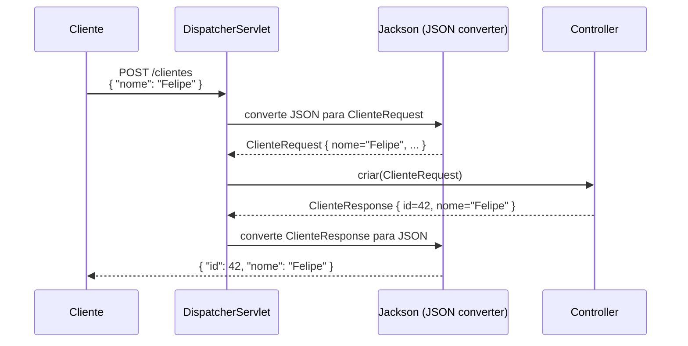

# 17 — @RequestBody e ResponseEntity

tags: #springboot #controllers #http #resposta
links: [[15 - Métodos HTTP GET POST PUT DELETE]] | [[16 - PathVariable e RequestParam]] | [[18 - O que são DTOs e Por que Usar]] | [[Estudos/Projetos/00-Maps/🗺️ Mapa Principal]]

---

## @RequestBody — lendo o corpo da requisição

`@RequestBody` instrui o Spring a **desserializar** (converter) o corpo JSON da requisição HTTP para um objeto Java.

```java
// Requisição:
// POST /clientes
// Content-Type: application/json
// { "nome": "Felipe", "email": "felipe@ex.com", "telefone": "11999887766" }

@PostMapping
public ResponseEntity<ClienteResponse> criar(
    @RequestBody ClienteRequest request  // Spring converte JSON → ClienteRequest
) {
    // request.nome() = "Felipe"
    // request.email() = "felipe@ex.com"
    return ResponseEntity.status(201).body(service.criar(request));
}
```

### Com validação — sempre use @Valid junto

```java
// Sem @Valid: o body é desserializado mas as validações NÃO são executadas
@PostMapping
public ResponseEntity<ClienteResponse> criar(@RequestBody ClienteRequest request) {
    // request pode ter nome null, email inválido, etc. — nenhum erro gerado
}

// Com @Valid: executa as anotações de validação do DTO antes de entrar no método
@PostMapping
public ResponseEntity<ClienteResponse> criar(
    @RequestBody @Valid ClienteRequest request  // ← @Valid aqui
) {
    // Se request.nome() for null, lança MethodArgumentNotValidException automaticamente
    // Sua @ExceptionHandler captura e retorna 400 Bad Request
}
```

### O que acontece internamente



---

## Configurando Jackson — o conversor JSON

O Spring Boot usa **Jackson** por padrão para serialização/desserialização JSON. Você pode customizar:

```java
@Configuration
public class JacksonConfig {

    @Bean
    public ObjectMapper objectMapper() {
        return JsonMapper.builder()
            // Não falha se o JSON tiver campos que o DTO não tem
            .configure(DeserializationFeature.FAIL_ON_UNKNOWN_PROPERTIES, false)
            // Serializa datas como string ISO-8601 (não como timestamp)
            .configure(SerializationFeature.WRITE_DATES_AS_TIMESTAMPS, false)
            // Ignora campos null na serialização (não inclui "campo": null)
            .serializationInclusion(JsonInclude.Include.NON_NULL)
            .addModule(new JavaTimeModule())  // suporte a LocalDate, LocalDateTime
            .build();
    }
}
```

Ou via `application.yml`:

```yaml
spring:
  jackson:
    deserialization:
      fail-on-unknown-properties: false
    serialization:
      write-dates-as-timestamps: false
    default-property-inclusion: non_null
```

### Anotações Jackson úteis nos DTOs

```java
public class ProdutoResponse {

    private Long id;

    @JsonProperty("nome_completo")  // nome diferente no JSON
    private String nome;

    @JsonIgnore  // não inclui no JSON de saída
    private String senhaHash;

    @JsonFormat(pattern = "dd/MM/yyyy HH:mm")  // formato de data customizado
    private LocalDateTime criadoEm;

    @JsonInclude(JsonInclude.Include.NON_NULL)  // só inclui se não for null
    private String observacao;
}
```

---

## ResponseEntity — controle total da resposta HTTP

`ResponseEntity<T>` representa a **resposta HTTP completa**: status code, headers e body.

```java
// Status 200 OK + body
return ResponseEntity.ok(objeto);
// equivalente a:
return ResponseEntity.status(HttpStatus.OK).body(objeto);

// Status 201 Created + body
return ResponseEntity.status(HttpStatus.CREATED).body(objeto);
// ou o shortcut:
return ResponseEntity.created(uri).body(objeto);

// Status 204 No Content (sem body)
return ResponseEntity.noContent().build();

// Status 404 Not Found (sem body)
return ResponseEntity.notFound().build();

// Status 400 Bad Request + mensagem de erro
return ResponseEntity.badRequest().body(errorResponse);
```

### Adicionando headers à resposta

```java
@PostMapping
public ResponseEntity<ClienteResponse> criar(@RequestBody @Valid ClienteRequest req) {
    ClienteResponse response = service.criar(req);

    return ResponseEntity
        .status(HttpStatus.CREATED)
        .header("X-Cliente-Id", response.id().toString())  // header customizado
        .header(HttpHeaders.LOCATION, "/api/v1/clientes/" + response.id())
        .body(response);
}
```

### Builder pattern do ResponseEntity

```java
// Construindo respostas complexas
@GetMapping("/relatorio")
public ResponseEntity<byte[]> baixarRelatorio() {
    byte[] pdf = service.gerarRelatorio();

    return ResponseEntity.ok()
        .contentType(MediaType.APPLICATION_PDF)
        .header(HttpHeaders.CONTENT_DISPOSITION, "attachment; filename=relatorio.pdf")
        .contentLength(pdf.length)
        .body(pdf);
}
```

---

## Quando usar ResponseEntity vs retorno direto

```java
// Retorno direto — mais simples, assume 200 OK
@GetMapping("/{id}")
public ClienteResponse buscar(@PathVariable Long id) {
    return service.buscarPorId(id);  // status 200 automaticamente
}

// ResponseEntity — mais controle
@GetMapping("/{id}")
public ResponseEntity<ClienteResponse> buscar(@PathVariable Long id) {
    return ResponseEntity.ok(service.buscarPorId(id));
}
```

**Use `ResponseEntity` quando:**
- Precisa retornar status diferente de 200 (201, 204, 202, etc.)
- Precisa adicionar headers à resposta
- Pode retornar `null` ou resposta sem body
- Para padronização no projeto (recomendado sempre usar)

**Pode retornar diretamente quando:**
- Sempre 200 OK
- Sem headers customizados
- Projeto muito simples

> 💡 **Recomendação:** use `ResponseEntity` em todos os métodos do controller. É mais explícito e facilita leitura/manutenção.

---

## Padrão de resposta — GenericResponse

Para APIs com muitos endpoints, padronize as respostas:

```java
// Wrapper genérico para respostas
public record ApiResponse<T>(
    boolean sucesso,
    String mensagem,
    T dados,
    LocalDateTime timestamp
) {
    public static <T> ApiResponse<T> ok(T dados) {
        return new ApiResponse<>(true, "Operação realizada com sucesso", dados, LocalDateTime.now());
    }

    public static <T> ApiResponse<T> ok(String mensagem, T dados) {
        return new ApiResponse<>(true, mensagem, dados, LocalDateTime.now());
    }

    public static ApiResponse<Void> erro(String mensagem) {
        return new ApiResponse<>(false, mensagem, null, LocalDateTime.now());
    }
}

// Usando no controller:
@GetMapping("/{id}")
public ResponseEntity<ApiResponse<ClienteResponse>> buscar(@PathVariable Long id) {
    ClienteResponse cliente = service.buscarPorId(id);
    return ResponseEntity.ok(ApiResponse.ok(cliente));
}

// Resposta JSON resultante:
// {
//   "sucesso": true,
//   "mensagem": "Operação realizada com sucesso",
//   "dados": { "id": 42, "nome": "Felipe" },
//   "timestamp": "2024-01-15T10:30:00"
// }
```

> ⚠️ Esse padrão é opcional e controverso. APIs maduras (GitHub, Stripe, etc.) preferem retornar o objeto direto com status HTTP expressivo. O `ApiResponse` wrapper é comum em empresas que querem padronização uniforme, mas adiciona verbosidade.

---

## Exemplo completo — controller com todos os conceitos

```java
@RestController
@RequestMapping("/api/v1/clientes")
public class ClienteController {

    private final ClienteService service;

    public ClienteController(ClienteService service) {
        this.service = service;
    }

    @PostMapping
    public ResponseEntity<ClienteResponse> criar(
        @RequestBody @Valid ClienteRequest request
    ) {
        var response = service.criar(request);

        URI location = ServletUriComponentsBuilder
            .fromCurrentRequest()
            .path("/{id}")
            .buildAndExpand(response.id())
            .toUri();

        return ResponseEntity.created(location).body(response);
        // HTTP 201 + Location header + body JSON
    }

    @GetMapping("/{id}")
    public ResponseEntity<ClienteResponse> buscar(@PathVariable Long id) {
        return ResponseEntity.ok(service.buscarPorId(id));
        // HTTP 200 + body JSON
    }

    @GetMapping
    public ResponseEntity<Page<ClienteResponse>> listar(
        @PageableDefault(size = 20) Pageable pageable
    ) {
        return ResponseEntity.ok(service.listar(pageable));
    }

    @PutMapping("/{id}")
    public ResponseEntity<ClienteResponse> atualizar(
        @PathVariable Long id,
        @RequestBody @Valid ClienteUpdateRequest request
    ) {
        return ResponseEntity.ok(service.atualizar(id, request));
        // HTTP 200 + body JSON
    }

    @DeleteMapping("/{id}")
    public ResponseEntity<Void> deletar(@PathVariable Long id) {
        service.deletar(id);
        return ResponseEntity.noContent().build();
        // HTTP 204 — sem body
    }
}
```

---

## Próximas notas
- [[18 - O que são DTOs e Por que Usar]] — aprofundando nos DTOs
- [[32 - ControllerAdvice e ExceptionHandler]] — tratando erros globalmente
