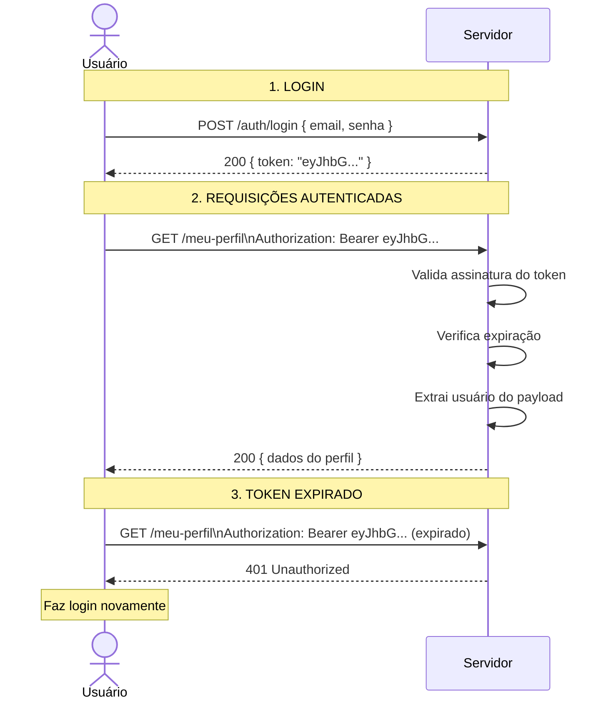

# 37 — JWT: Conceito e Implementação

tags: #springboot #segurança #jwt #token
links: [[35 - Introdução ao Spring Security]] | [[36 - Autenticação vs Autorização]] | [[38 - Filtros de Segurança]] | [[Estudos/Projetos/00-Maps/🗺️ Mapa Principal]]

---

## O que é JWT

**JWT (JSON Web Token)** é um padrão aberto (RFC 7519) para transmitir informações de forma segura entre partes como um objeto JSON assinado digitalmente.

Na prática: após o login, o servidor emite um token que o cliente envia em cada requisição para provar que está autenticado — sem precisar consultar o banco a cada request.

---

## Estrutura de um JWT

Um JWT tem 3 partes separadas por ponto:

```
eyJhbGciOiJIUzI1NiIsInR5cCI6IkpXVCJ9    ← HEADER (base64)
.
eyJzdWIiOiJmZWxpcGVAZXguY29tIiwiaWQiOjEsInJvbGUiOiJVU0VSIiwiaWF0IjoxNzA1MzE0NjAwLCJleHAiOjE3MDU0MDEwMDB9    ← PAYLOAD (base64)
.
SflKxwRJSMeKKF2QT4fwpMeJf36POk6yJV_adQssw5c    ← SIGNATURE (HMAC-SHA256)
```

### Header — algoritmo e tipo

```json
{
  "alg": "HS256",   // algoritmo: HMAC-SHA256
  "typ": "JWT"
}
```

### Payload — os dados (claims)

```json
{
  "sub": "felipe@ex.com",          // subject: identifica o usuário
  "id": 1,                          // claim customizada
  "role": "USER",                   // claim customizada
  "iat": 1705314600,                // issued at: quando foi emitido (Unix timestamp)
  "exp": 1705401000                 // expiration: quando expira
}
```

> ⚠️ O payload é apenas **codificado em Base64**, não criptografado. Qualquer pessoa pode decodificá-lo. **Nunca coloque dados sensíveis** (senha, cartão de crédito) no payload do JWT.

### Signature — garantia de integridade

```
HMAC_SHA256(
  base64(header) + "." + base64(payload),
  chave_secreta
)
```

A assinatura garante que o token não foi alterado. Se alguém modificar o payload, a assinatura não baterá mais e o token será rejeitado.

---

## Fluxo completo JWT



---

## JwtService — implementação completa

```java
package com.empresa.api.security;

import io.jsonwebtoken.*;
import io.jsonwebtoken.io.Decoders;
import io.jsonwebtoken.security.Keys;
import org.springframework.beans.factory.annotation.Value;
import org.springframework.security.core.userdetails.UserDetails;
import org.springframework.stereotype.Service;

import javax.crypto.SecretKey;
import java.util.*;
import java.util.function.Function;

@Service
public class JwtService {

    @Value("${app.jwt.secret}")
    private String chaveSecreta;

    @Value("${app.jwt.expiration:86400000}")    // padrão: 24h em ms
    private long expiracaoMs;

    // ===== GERAÇÃO DO TOKEN =====

    public String gerarToken(UserDetails userDetails) {
        return gerarToken(new HashMap<>(), userDetails);
    }

    public String gerarToken(Map<String, Object> claimsExtras, UserDetails userDetails) {
        var usuario = (com.empresa.api.usuario.Usuario) userDetails;

        return Jwts.builder()
            .claims(claimsExtras)
            .claim("id", usuario.getId())
            .claim("nome", usuario.getNome())
            .claim("role", usuario.getRole().name())
            .subject(usuario.getEmail())              // "sub" claim
            .issuedAt(new Date())                     // "iat" claim
            .expiration(new Date(System.currentTimeMillis() + expiracaoMs))  // "exp" claim
            .signWith(getChave())                     // assina com HMAC-SHA256
            .compact();                               // serializa para String
    }

    // ===== VALIDAÇÃO DO TOKEN =====

    public boolean isTokenValido(String token, UserDetails userDetails) {
        final String email = extrairEmail(token);
        return email.equals(userDetails.getUsername()) && !isTokenExpirado(token);
    }

    private boolean isTokenExpirado(String token) {
        return extrairExpiracao(token).before(new Date());
    }

    // ===== EXTRAÇÃO DE DADOS =====

    public String extrairEmail(String token) {
        return extrairClaim(token, Claims::getSubject);
    }

    public Long extrairId(String token) {
        return extrairClaim(token, claims -> claims.get("id", Long.class));
    }

    public String extrairRole(String token) {
        return extrairClaim(token, claims -> claims.get("role", String.class));
    }

    public Date extrairExpiracao(String token) {
        return extrairClaim(token, Claims::getExpiration);
    }

    public long getExpiracao() {
        return System.currentTimeMillis() + expiracaoMs;
    }

    // Extrator genérico — recebe uma função que extrai o claim desejado
    public <T> T extrairClaim(String token, Function<Claims, T> claimsResolver) {
        final Claims claims = extrairTodosClaims(token);
        return claimsResolver.apply(claims);
    }

    private Claims extrairTodosClaims(String token) {
        return Jwts.parser()
            .verifyWith(getChave())       // verifica a assinatura
            .build()
            .parseSignedClaims(token)     // parseia e valida
            .getPayload();               // retorna o payload (Claims)
        // Lança exceções se token inválido/expirado:
        // ExpiredJwtException, MalformedJwtException, SignatureException
    }

    // Converte a chave secreta (String) para um objeto SecretKey
    private SecretKey getChave() {
        byte[] keyBytes = Decoders.BASE64.decode(chaveSecreta);
        return Keys.hmacShaKeyFor(keyBytes);
    }
}
```

---

## Gerando uma chave secreta segura

```bash
# A chave deve ser forte (pelo menos 256 bits = 32 bytes para HS256)
# Gerar em base64:

# Linux/Mac:
openssl rand -base64 32
# Exemplo: "K7gNU3sdo+OL0wNhqoVWhr3g6s1xYv72ol/pe/Unols="

# Ou via Java:
import io.jsonwebtoken.security.Keys;
import java.util.Base64;
SecretKey key = Keys.secretKeyFor(SignatureAlgorithm.HS256);
String base64Key = Base64.getEncoder().encodeToString(key.getEncoded());
```

```yaml
# application.yml — NUNCA commite a chave real!
app:
  jwt:
    secret: ${JWT_SECRET}              # variável de ambiente em produção
    expiration: 86400000               # 24 horas

# Para desenvolvimento local:
# application-dev.yml (no .gitignore)
app:
  jwt:
    secret: K7gNU3sdo+OL0wNhqoVWhr3g6s1xYv72ol/pe/Unols=
    expiration: 86400000
```

---

## Refresh Token — renovação sem novo login

```java
// Tabela no banco para refresh tokens
@Entity @Table(name = "refresh_tokens")
public class RefreshToken {
    @Id @GeneratedValue(strategy = GenerationType.IDENTITY)
    private Long id;

    @Column(nullable = false, unique = true)
    private String token;  // UUID gerado aleatoriamente

    @ManyToOne(fetch = FetchType.LAZY)
    @JoinColumn(name = "usuario_id", nullable = false)
    private Usuario usuario;

    @Column(name = "expira_em", nullable = false)
    private LocalDateTime expiraEm;

    @Column(name = "usado", nullable = false)
    private boolean usado = false;

    public boolean isValido() {
        return !usado && expiraEm.isAfter(LocalDateTime.now());
    }
}

// Service
@Service
public class RefreshTokenService {

    private final RefreshTokenRepository repository;
    private final JwtService jwtService;

    @Transactional
    public AuthResponse renovar(String refreshToken) {
        var token = repository.findByToken(refreshToken)
            .orElseThrow(() -> new RegraDeNegocioException("Refresh token inválido"));

        if (!token.isValido()) {
            throw new RegraDeNegocioException("Refresh token expirado ou já utilizado");
        }

        token.marcarComoUsado();  // token de uso único

        // Gera novo access token e novo refresh token
        String novoAccessToken = jwtService.gerarToken(token.getUsuario());
        RefreshToken novoRefresh = criarRefreshToken(token.getUsuario());

        return new AuthResponse(novoAccessToken, novoRefresh.getToken(),
                                jwtService.getExpiracao(),
                                UsuarioResponse.from(token.getUsuario()));
    }

    @Transactional
    public RefreshToken criarRefreshToken(Usuario usuario) {
        var rt = new RefreshToken();
        rt.setToken(UUID.randomUUID().toString());
        rt.setUsuario(usuario);
        rt.setExpiraEm(LocalDateTime.now().plusDays(7));  // 7 dias
        return repository.save(rt);
    }
}
```

---

## Próximas notas
- [[38 - Filtros de Segurança]] — o JwtAuthFilter que intercepta cada requisição
