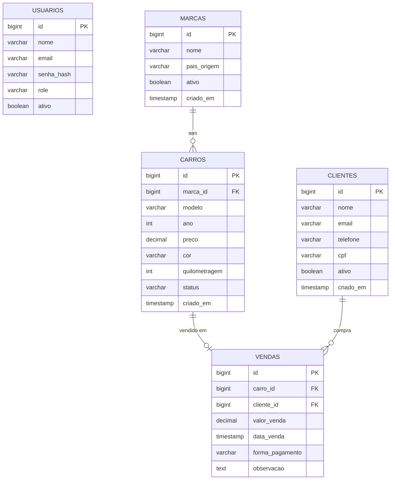

# 49 — Projeto Concessionária — Visão Geral e Setup

tags: #springboot #projeto #concessionária
links: [[50 - Projeto Concessionária - Entidades]] | [[51 - Projeto Concessionária - Controllers e DTOs]] | [[52 - Projeto Concessionária - Segurança e JWT]] | [[53 - Projeto Concessionária - Paginação e Docs]] | [[Estudos/Projetos/00-Maps/🗺️ Mapa Principal]]

---

## O que vamos construir

Uma API REST completa para uma concessionária de veículos, com:

- CRUD de **Marcas**, **Carros**, **Clientes** e **Vendas**
- Relacionamentos entre entidades
- DTOs de entrada e saída
- Validação com Bean Validation
- Autenticação e autorização com JWT
- Paginação e filtros
- Tratamento global de exceções
- Documentação com Swagger
- Migrations com Flyway

---

## Domínio do sistema



---

## Setup do projeto

### Spring Initializr

```
Group:    com.concessionaria
Artifact: api
Java:     21
Packaging: Jar

Dependências:
- Spring Web
- Spring Data JPA
- PostgreSQL Driver
- Spring Security
- Spring Boot Validation
- Lombok
- Spring Boot DevTools
- Flyway Migration
```

### pom.xml final

```xml
<?xml version="1.0" encoding="UTF-8"?>
<project xmlns="http://maven.apache.org/POM/4.0.0"
         xmlns:xsi="http://www.w3.org/2001/XMLSchema-instance"
         xsi:schemaLocation="http://maven.apache.org/POM/4.0.0
         https://maven.apache.org/xsd/maven-4.0.0.xsd">
    <modelVersion>4.0.0</modelVersion>

    <parent>
        <groupId>org.springframework.boot</groupId>
        <artifactId>spring-boot-starter-parent</artifactId>
        <version>3.2.3</version>
    </parent>

    <groupId>com.concessionaria</groupId>
    <artifactId>api</artifactId>
    <version>1.0.0</version>
    <name>Concessionaria API</name>

    <properties>
        <java.version>21</java.version>
    </properties>

    <dependencies>
        <dependency>
            <groupId>org.springframework.boot</groupId>
            <artifactId>spring-boot-starter-web</artifactId>
        </dependency>
        <dependency>
            <groupId>org.springframework.boot</groupId>
            <artifactId>spring-boot-starter-data-jpa</artifactId>
        </dependency>
        <dependency>
            <groupId>org.springframework.boot</groupId>
            <artifactId>spring-boot-starter-security</artifactId>
        </dependency>
        <dependency>
            <groupId>org.springframework.boot</groupId>
            <artifactId>spring-boot-starter-validation</artifactId>
        </dependency>
        <dependency>
            <groupId>org.postgresql</groupId>
            <artifactId>postgresql</artifactId>
            <scope>runtime</scope>
        </dependency>
        <dependency>
            <groupId>org.flywaydb</groupId>
            <artifactId>flyway-core</artifactId>
        </dependency>
        <dependency>
            <groupId>org.flywaydb</groupId>
            <artifactId>flyway-database-postgresql</artifactId>
        </dependency>
        <dependency>
            <groupId>org.projectlombok</groupId>
            <artifactId>lombok</artifactId>
            <optional>true</optional>
        </dependency>
        <dependency>
            <groupId>io.jsonwebtoken</groupId>
            <artifactId>jjwt-api</artifactId>
            <version>0.12.3</version>
        </dependency>
        <dependency>
            <groupId>io.jsonwebtoken</groupId>
            <artifactId>jjwt-impl</artifactId>
            <version>0.12.3</version>
            <scope>runtime</scope>
        </dependency>
        <dependency>
            <groupId>io.jsonwebtoken</groupId>
            <artifactId>jjwt-jackson</artifactId>
            <version>0.12.3</version>
            <scope>runtime</scope>
        </dependency>
        <dependency>
            <groupId>org.springdoc</groupId>
            <artifactId>springdoc-openapi-starter-webmvc-ui</artifactId>
            <version>2.3.0</version>
        </dependency>
        <dependency>
            <groupId>org.springframework.boot</groupId>
            <artifactId>spring-boot-starter-test</artifactId>
            <scope>test</scope>
        </dependency>
        <dependency>
            <groupId>org.springframework.security</groupId>
            <artifactId>spring-security-test</artifactId>
            <scope>test</scope>
        </dependency>
    </dependencies>

    <build>
        <plugins>
            <plugin>
                <groupId>org.springframework.boot</groupId>
                <artifactId>spring-boot-maven-plugin</artifactId>
                <configuration>
                    <excludes>
                        <exclude>
                            <groupId>org.projectlombok</groupId>
                            <artifactId>lombok</artifactId>
                        </exclude>
                    </excludes>
                </configuration>
            </plugin>
        </plugins>
    </build>
</project>
```

### application.yml

```yaml
server:
  port: 8080

spring:
  application:
    name: concessionaria-api

  datasource:
    url: jdbc:postgresql://localhost:5432/concessionaria
    username: postgres
    password: ${DB_PASSWORD:postgres}
    hikari:
      maximum-pool-size: 10
      minimum-idle: 5

  jpa:
    hibernate:
      ddl-auto: none
    show-sql: false
    open-in-view: false
    properties:
      hibernate:
        dialect: org.hibernate.dialect.PostgreSQLDialect
        format_sql: true

  flyway:
    enabled: true
    locations: classpath:db/migration

app:
  jwt:
    secret: ${JWT_SECRET:dGhpcyBpcyBhIHZlcnkgbG9uZyBzZWNyZXQga2V5IGZvciBqd3Q=}
    expiration: 86400000

logging:
  level:
    com.concessionaria: INFO
    org.hibernate.SQL: DEBUG

springdoc:
  api-docs:
    path: /api-docs
  swagger-ui:
    path: /swagger-ui.html
```

### Estrutura de pacotes

```
src/main/java/com/concessionaria/api/
│
├── domain/                          # REGRA DE NEGÓCIO (independente de framework)
│   ├── model/
│   │   ├── Car.java                 # class (entidade de domínio)
│   │   ├── Customer.java            # class
│   │   ├── Sale.java                # class
│   │   ├── Brand.java               # class
│   │   ├── User.java                # class
│   │   └── Role.java                # enum
│   │
│   ├── repository/
│   │   ├── CarRepository.java       # interface
│   │   ├── CustomerRepository.java  # interface
│   │   ├── SaleRepository.java      # interface
│   │   ├── BrandRepository.java     # interface
│   │   └── UserRepository.java      # interface
│   │
│   ├── exception/
│   │   ├── BusinessRuleException.java        # class (extends RuntimeException)
│   │   ├── ResourceNotFoundException.java   # class (extends RuntimeException)
│   │   └── ResourceAlreadyExistsException.java # class (extends RuntimeException)
│
├── application/                     # CASOS DE USO
│   ├── usecase/
│   │   ├── CreateSaleUseCase.java       # class
│   │   ├── ListCarsUseCase.java         # class
│   │   ├── RegisterCustomerUseCase.java # class
│   │   ├── CreateCarUseCase.java        # class
│   │   └── CreateBrandUseCase.java      # class
│   │
│   └── dto/
│       ├── SaleRequest.java        # record ou class
│       ├── SaleResponse.java       # record ou class
│       ├── CarRequest.java         # record ou class
│       ├── CarResponse.java        # record ou class
│       ├── CustomerRequest.java    # record ou class
│       └── CustomerResponse.java   # record ou class
│
├── infrastructure/                 # IMPLEMENTAÇÕES (depende de framework)
│   ├── persistence/
│   │   ├── entity/
│   │   │   ├── CarEntity.java         # class (@Entity)
│   │   │   ├── CustomerEntity.java    # class (@Entity)
│   │   │   ├── SaleEntity.java        # class (@Entity)
│   │   │   └── BrandEntity.java       # class (@Entity)
│   │   │
│   │   ├── repository/
│   │   │   ├── JpaCarRepository.java      # interface (extends JpaRepository)
│   │   │   ├── JpaCustomerRepository.java # interface
│   │   │   ├── JpaSaleRepository.java     # interface
│   │   │   └── JpaBrandRepository.java    # interface
│   │   │
│   │   └── adapter/
│   │       ├── CarRepositoryImpl.java      # class (implements CarRepository)
│   │       ├── CustomerRepositoryImpl.java # class
│   │       ├── SaleRepositoryImpl.java     # class
│   │       └── BrandRepositoryImpl.java    # class
│   │
│   ├── security/
│   │   ├── JwtService.java              # class
│   │   ├── JwtAuthFilter.java           # class
│   │   └── UserDetailsServiceImpl.java  # class
│   │
│   └── config/
│       ├── SecurityConfig.java   # class
│       └── SwaggerConfig.java   # class
│
└── main/
    └── DealershipApiApplication.java  # class (@SpringBootApplication)
```

---

## Próximas notas
- [[50 - Projeto Concessionária - Entidades]] — todas as entidades JPA + migrations
