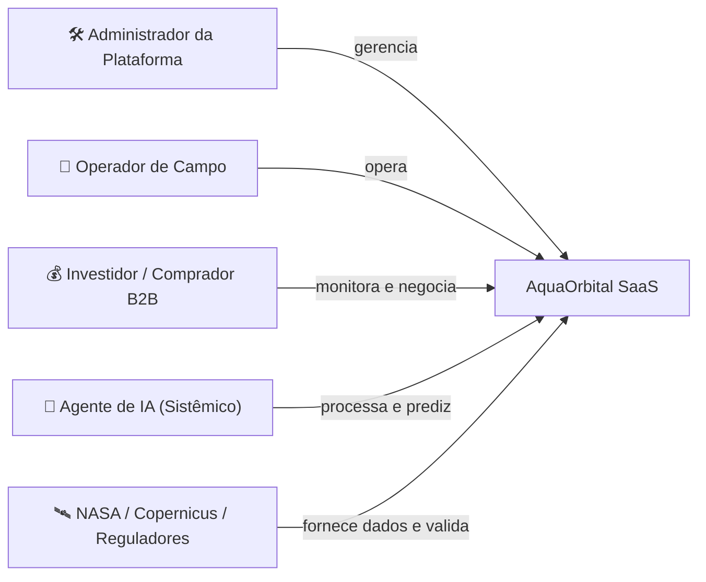
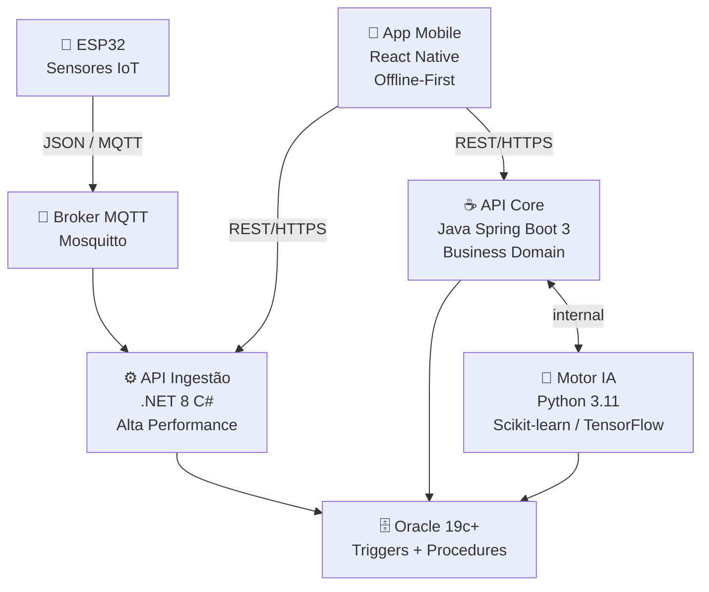

# 🌊 AquaOrbital — Especificação Arquitetural TOGAF ADM

> [!abstract] Visão Geral
> Plataforma integrada de **IoT + IA + Dados Orbitais** para otimização da produção de biomassa de microalgas, geração de créditos de carbono auditáveis e combate à insegurança alimentar. Arquitetura estruturada sob o **TOGAF ADM (Fases A–D)** combinado ao **Plano de Qualidade ISO 25010**.

---

## 🗺️ Navegação Rápida

| Seção | Conteúdo |
|---|---|
| [[#Fase A — Architecture Vision]] | Stakeholders, Drivers, Goals, Requisitos, Princípios |
| [[#Fase B — Business Architecture]] | Atores, Serviços, Processos, AS-IS vs TO-BE |
| [[#Fase C — Information Systems Architecture]] | Componentes, Endpoints, Objetos de Dados |
| [[#Fase D — Technology Architecture]] | Nós, Rede, Artefatos de Implantação |
| [[#Plano de Qualidade]] | ISO 25010, Riscos, Suíte de Testes |
| [[#Modelagem ArchiMate]] | Orientações por fase |

---

## Fase A — Architecture Vision

### 👥 Stakeholders

| Stakeholder | Interesse / Impacto |
|---|---|
| Cooperativas Agrícolas e Produtores Rurais | Cliente SaaS principal; otimização de cultivo e democratização da bioeconomia no Nordeste |
| Operadores de Campo | Monitoramento de tanques, sensores e registros de coleta via app |
| Investidores / Compradores de Créditos de Carbono | Aquisição de créditos com rastreabilidade de CO₂ |
| Indústrias de Biotecnologia Alimentar e Farmacêutica | Compradores B2B de Spirulina e Chlorella |
| ONGs e Agências Antifome | Microalgas como superalimento de alta densidade proteica |
| Agências Reguladoras de Carbono | Validação externa de conformidade legal |
| Provedores Orbitais (NASA / ESA Copernicus) | APIs de irradiância PAR e dados climáticos |
| Equipe Técnica e Avaliadores Acadêmicos | Desenvolvimento, manutenção e validação de entregas |

---

### 🚀 Drivers (Direcionadores de Negócio)

> [!info] Contexto Estratégico
> Os drivers abaixo fundamentam as decisões arquiteturais do projeto.

- **Segurança Alimentar Global** — fontes proteicas sustentáveis frente às crises climáticas
- **Expansão do Mercado de Carbono** — demanda por créditos NBS com rastreabilidade
- **Resiliência Climática no Semiárido** — superação das restrições hídricas no campo
- **Maturidade de Hardware IoT** — ESP32 de baixo custo + ML preditivo
- **Subutilização de Dados Espaciais** — dados orbitais públicos desconectados do pequeno produtor

---

### 📋 Assessments

> [!warning] Cenário Atual
> - Comunidades isoladas sem suporte técnico e laboratórios físicos
> - Cultivo de microalgas excessivamente artesanal no Brasil
> - Mercado de carbono com opacidade e risco de greenwashing
> - Validação lógica via Wokwi + Spring Boot + .NET 8 + Oracle viável em nível de protótipo

---

### 🎯 Goals (Objetivos Estratégicos)

| ID | Objetivo | Mecanismo |
|---|---|---|
| G01 | Monitorar tanques em tempo real | Telemetria contínua via ESP32 |
| G02 | Centralizar e assegurar persistência | Banco Oracle transacional |
| G03 | Integrar dados orbitais à agricultura | APIs NASA/Copernicus (PAR) |
| G04 | Mitigar perdas de safra biológica | Triggers Oracle + notificações push |
| G05 | Estimar crescimento de biomassa preditivamente | Motor IA Python (LSTM / Regressão) |
| G06 | Auditar e monetizar captura de carbono | Procedures PL/SQL + tokenização |
| G07 | Democratizar gestão operacional | App React Native com dashboards por perfil |
| G08 | Referência em plataforma Space-to-Agro | Microsserviços modulares e interoperáveis |

---

### 📌 Requirements (Requisitos Macro)

> [!note] Requisitos Funcionais e Não Funcionais

- **R01–R04** — Gestão de cadastros: perfis de acesso, fazendas, tanques e dispositivos IoT
- **R05–R06** — Ingestão de borda: ESP32 coleta pH, temperatura, luminosidade e turbidez em JSON
- **R07** — Persistência avançada: Oracle com Triggers e Procedures automatizadas
- **R08–R10** — Camada preditiva: cruzamento de limiares químicos com dados orbitais a cada 48h
- **R11–R13** — Comercialização B2B: rastreabilidade de CO₂, hashes de auditoria, marketplace
- **R14–R15** — Interfaces: app offline-first, OpenAPI/Swagger e suíte completa de testes

---

### 🧭 Principles (Princípios de Arquitetura)

| Princípio | Descrição |
|---|---|
| Dados Orbitais como Insumo Estratégico | Telemetria espacial como pilar central, não ilustrativo |
| Modularidade e Desacoplamento | Fronteiras claras: IoT / Ingestão / Core / IA / Persistência |
| Offline-First no Campo | Tolerância a falhas de conectividade; sync assíncrona |
| Auditabilidade Total do Carbono | Rastreabilidade do sensor físico ao marketplace |
| Segurança por Design | Containers não-root, JWT/OAuth, isolamento de credenciais |

---

### ⛔ Constraints (Restrições)

> [!danger] Restrições de Projeto
> - Conectividade instável em áreas rurais → protocolos leves + persistência local
> - APIs NASA/ESA sem SLA garantido → mecanismos de cache na aplicação
> - Hardware limitado ao ESP32 + simulação Wokwi (escopo acadêmico)
> - **Oracle Database mandatório** por diretriz institucional

---

## Fase B — Business Architecture

### 🎭 Atores e Papéis de Negócio



---

### 🏢 Serviços de Negócio

- **Gestão de Fazendas e Cultivos** — estrutura geográfica e operacional das plantas
- **Monitoramento Automatizado em Tempo Real** — variáveis físico-químicas dos tanques
- **Predição Avançada de Safra Celular** — projeções de biomassa (g/L) para decisões comerciais
- **Tokenização e Auditoria Ambiental** — conversão de massa biológica em créditos de carbono com hash
- **Marketplace Transacional B2B** — negociação direta de biomassa e ativos ambientais

---

### 🔄 Processos de Negócio

> [!example] Ciclo 1 — Monitoramento Contínuo
> `Sensores IoT` → `Broker MQTT` → `API Ingestão` → `Validação de Limiares` → `Oracle DB`

> [!example] Ciclo 2 — Predição e Correlação Orbital
> `Dados Orbitais PAR` → `Modelo ML` → `Projeção 48h` → `Dashboard do Produtor`

> [!example] Ciclo 3 — Colheita e Comercialização
> `Pico de Biomassa Detectado` → `Notificação ao Operador` → `Colheita Física` → `Registro App Mobile` → `Marketplace B2B`

> [!example] Ciclo 4 — Auditoria de Carbono
> `Agrupamento de CO₂` → `Rotina PL/SQL 24h` → `Hash Rastreável` → `Perfil Investidor`

---

### 🔀 Transformação AS-IS → TO-BE

| Dimensão | AS-IS (Atual) | TO-BE (Proposto) |
|---|---|---|
| Coleta de métricas | Manual com termômetros/reagentes | Sensores IoT em tempo real automatizados |
| Registro operacional | Cadernos físicos ou planilhas offline | Armazenamento estruturado no Oracle |
| Dados climáticos | Inexistentes no processo | APIs orbitais PAR integradas automaticamente |
| Decisão de colheita | Visual (cor da água) | IA preditiva com 48h de antecedência |
| Venda de biomassa | Intermediários locais informais | Marketplace B2B integrado e global |
| Créditos de carbono | Ausência total | Cálculo automático PL/SQL com hashes auditáveis |

---

## Fase C — Information Systems Architecture

### 🧩 Componentes de Aplicação



---

### 🔌 Catálogo de Endpoints

| Verbo | Endpoint | Componente | Descrição |
|---|---|---|---|
| `POST` | `/telemetria` | API .NET | Recebe e valida dados de sensores via HTTP/MQTT |
| `GET` | `/fazendas/{id}/dashboard` | API Java | Status condensado dos tanques para o app |
| `GET` | `/previsoes/{fazenda_id}` | Java ↔ Python IA | Estimativas de biomassa via ML |
| `POST` | `/marketplace/lotes` | API Java | Publica lote de microalgas para negociação B2B |
| `GET` | `/carbono/extrato/{id}` | API Java | Histórico auditável de CO₂ retido |
| `POST` | `/alertas` | Oracle ↔ API .NET | Trigger Oracle → push notification crítica |
| `GET` | `/dados-orbitais/{id}` | API .NET | Métricas PAR dos servidores espaciais |

---

### 🗂️ Objetos de Dados

| DTO / Entidade | Campos Principais | Tabela Oracle |
|---|---|---|
| `TelemetriaDTO` | dispositivo_id, timestamp, pH, temp, turbidez, luminosidade | `TB_METRICAS_TANQUE` |
| `PrevisaoSafraDTO` | tanque_id, biomassa_g_L, data_pico, confianca_% | `TB_PREVISOES_IA` |
| `LoteMarketplaceDTO` | lote_id, taxonomia_alga, peso_kg, preco, status, fazenda_id | `TB_LOTE_BIOMASSA` |
| `CreditoCarbono` | co2_toneladas, timestamp_validacao, status, hash_auditoria | `TB_CREDITO_CARBONO` |
| `DadoOrbitalDTO` | area_id, indice_PAR, nebulosidade, timestamp_satelite | `TB_DADO_ORBITAL` |

---

## Fase D — Technology Architecture

### 🖥️ Nós, Dispositivos e Software

| Categoria | Elemento | Especificação |
|---|---|---|
| **Nós** | Borda | ESP32 / Simulação Wokwi |
| | Aplicação Cloud | Azure App Service / AWS ECS + Docker |
| | Persistência | Docker + Oracle DB |
| | Processamento Preditivo | Docker isolado + Python runtime |
| **Dispositivos** | Microcontrolador | ESP32 MCU |
| | Sensores | pH, DS18B20 (temp), LDR |
| | Atuadores | Servomotores, relés, LEDs |
| | Interfaces | Smartphones Android/iOS |
| **Software** | Linguagens | Java 17, .NET 8 C#, Python 3.11 |
| | Mensageria | Mosquitto MQTT (1883/8883) |
| | Orquestração | Docker, Docker Compose, Wokwi, Expo |

---

### 🌐 Topologia de Rede

```
┌─────────────────────────────────────────────────────┐
│                   FIELD LAYER                       │
│   [ESP32] ──MQTT──> [Mosquitto Broker]              │
│    pH / Temp / LDR / Turbidez                       │
└─────────────────────┬───────────────────────────────┘
                      │ MQTT
┌─────────────────────▼───────────────────────────────┐
│               APPLICATION LAYER                     │
│  [API .NET 8] ──TCP──> [Oracle 19c+]                │
│  [API Java]   ──TCP──> [Oracle 19c+]                │
│  [Python IA]  ──TCP──> [Oracle 19c+]                │
│  [React Native App] ──HTTPS──> [APIs]               │
└─────────────────────┬───────────────────────────────┘
                      │ HTTPS
┌─────────────────────▼───────────────────────────────┐
│             EXTERNAL INTEGRATIONS                   │
│   NASA POWER API  /  ESA Copernicus                 │
│   (Dados PAR, Radiação, Clima)                      │
└─────────────────────────────────────────────────────┘
```

---

### 📦 Artefatos de Implantação

| Artefato | Tipo | Descrição |
|---|---|---|
| `aquaorbital-java-api.jar` | Executável | Core business Spring Boot |
| `aquaorbital-dotnet-api.dll` | Binário | API ingestão alta performance |
| `docker-compose.yml` | Manifesto | Orquestração completa de microsserviços |
| `schema.sql` / `procedures.sql` / `triggers.sql` | DDL/PL/SQL | Estrutura e inteligência do banco |
| `sketch_esp32.ino` / `wokwi-diagram.json` | Firmware/Circuito | Código C++ embarcado + simulação |
| `pipeline.yml` | CI/CD | GitHub Actions: lint → build → test → deploy |

---

## Plano de Qualidade

### ✅ Critérios ISO 25010

| Característica | Mecanismo no AquaOrbital |
|---|---|
| **Adequação Funcional** | Cobertura integral: cadastros, ingestão, alertas, CO₂, marketplace |
| **Eficiência de Desempenho** | .NET 8 assíncrono para picos de telemetria; paginação nas APIs Java |
| **Compatibilidade** | Payloads JSON universais via HTTP/MQTT |
| **Usabilidade** | UI mobile otimizada para alta luminosidade solar e operadores sem treinamento |
| **Confiabilidade** | Tolerância a falhas na ingestão; integridade relacional Oracle |
| **Segurança** | JWT, criptografia de senhas, privilégios mínimos no banco |
| **Manutenibilidade** | Clean Architecture: Controller → Service → Repository → DTO |

---

### ⚠️ Matriz de Riscos e Mitigação

| # | Risco | Probabilidade | Impacto | Mitigação |
|---|---|---|---|---|
| R1 | Payload corrompido do ESP32 | Alta | Alto | Data Annotation + Fluent Validation na API .NET |
| R2 | Sem conectividade rural na colheita | Alta | Alto | SQLite local no React Native + sync assíncrona |
| R3 | Falha na detecção de pH/Temp crítico | Média | Crítico | Triggers Oracle monitorando `TB_METRICAS_TANQUE` |
| R4 | Degradação com múltiplas fazendas concorrentes | Média | Alto | Índices em FKs + timestamps; HikariCP no Spring Boot |

---

### 🧪 Suíte de Testes (CT001–CT006)

| ID | Cenário | Entrada | Resultado Esperado |
|---|---|---|---|
| CT001 | Cadastro de Fazenda | `{"nome": "Cooperativa Juazeiro", "localizacao": "-9.416, -40.503"}` | HTTP 201, ID gerado no Oracle |
| CT002 | Ingestão Normal | `{"dispositivo_id": 10, "pH": 7.4, "temp": 26.5}` | HTTP 200, inserção limpa em `TB_METRICAS_TANQUE` |
| CT003 | Alerta de pH Crítico | `{"dispositivo_id": 10, "pH": 4.2, "temp": 25.0}` | Persistido + Trigger cria registro em `TB_ALERTA_CRITICO` |
| CT004 | Payload Incompleto | `{"dispositivo_id": 10, "pH": null}` | HTTP 400, campo obrigatório rejeitado |
| CT005 | Transação Duplicada | Compra de lote com status `VENDIDO` | HTTP 409, regra de negócio bloqueia a venda |
| CT006 | Quebra de Perfil JWT | Token `OPERADOR` acessando rota financeira | HTTP 403, interceptor barra a requisição |

#### Execução de Testes

- [ ] CT001 — Cadastro de Fazenda
- [ ] CT002 — Ingestão Normal
- [ ] CT003 — Alerta pH Crítico
- [ ] CT004 — Payload Incompleto
- [ ] CT005 — Transação Duplicada
- [ ] CT006 — Quebra de Perfil JWT

---

## Modelagem ArchiMate

> [!tip] Orientações para o Archi

**Phase A — Visão da Arquitetura**
Stakeholders → (Association) → Drivers → (Realization) → Goals → Requirements

**Phase B — Arquitetura de Negócio**
Business Actors → (Assignment) → Business Roles → Business Processes → Business Services

**Phase C — Sistemas de Informação**
Application Components (.NET / Java / Python IA) → Application Interfaces → Data Objects (Access: Read/Write) → Oracle DB

**Phase D — Arquitetura de Tecnologia**
Nodes (Cloud) + Devices (ESP32) → System Software (Docker / Oracle DBMS / JVM) → Communication Network (MQTT / HTTPS / TCP/IP)

---

## 📊 Dashboard (Dataview)

```dataview
TABLE status, priority, updated
FROM "AquaOrbital"
SORT updated DESC
```

```dataview
TASK
FROM "AquaOrbital"
WHERE !completed
GROUP BY file.name
```

---

*Documento gerado com base na especificação TOGAF ADM — AquaOrbital © 2024*