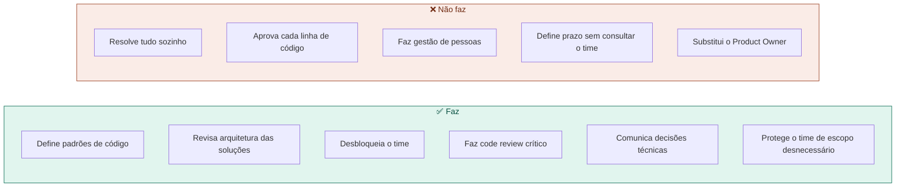
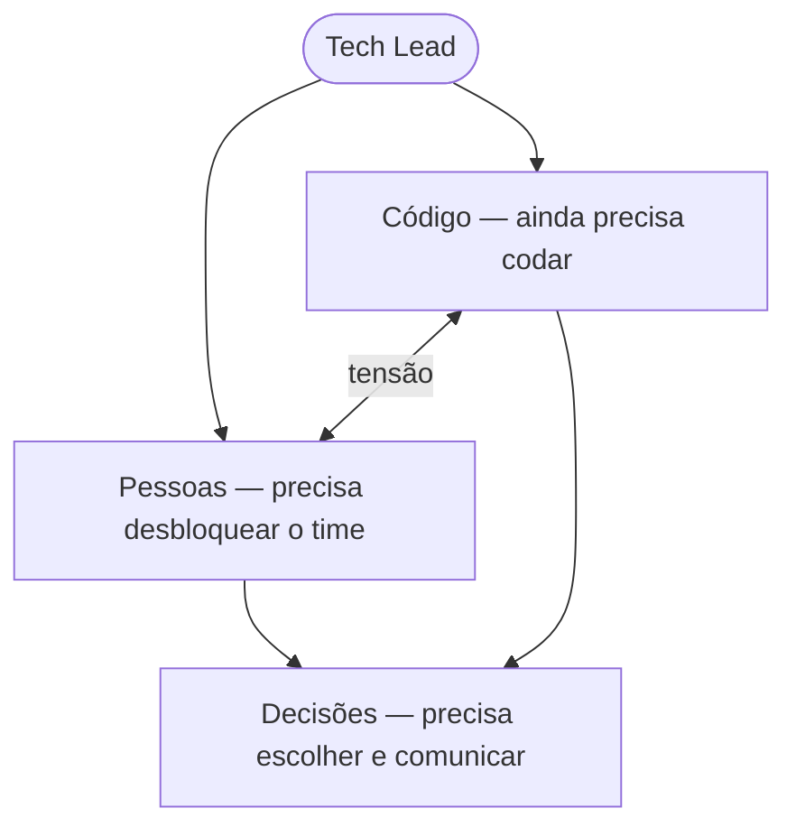

# 01 — O que é um Tech Lead

tags: #papéis #tech-lead #liderança
links: [[02 - O que é um Product Owner]] | [[03 - Perfis de Desenvolvedores]] | [[🗺️ Mapa Principal]]

---

## Definição

O Tech Lead é o desenvolvedor mais sênior do time que assume responsabilidade técnica coletiva — não só pelo próprio código, mas pelo código de todos.

> Tech Lead não é um título de hierarquia. É uma função de responsabilidade.

---

## O que o Tech Lead faz (e o que não faz)

---

## A tensão central do Tech Lead

O Tech Lead vive entre dois mundos:

**A armadilha mais comum:** o Tech Lead que vira "super dev" — escreve 80% do código, o time fica dependente, e quando ele sai o projeto para.

**O equilíbrio saudável:** Tech Lead escreve ~40–60% do código que escrevia antes de assumir o papel. O resto é review, arquitetura, desbloqueio e comunicação.

---

## Habilidades de um bom Tech Lead

| Habilidade técnica | Habilidade de gestão |
|---|---|
| Arquitetura de sistemas | Comunicação clara |
| Code review construtivo | Escuta ativa |
| Decisão de stack e ferramentas | Gestão de expectativas |
| Identificar dívida técnica | Dar e receber feedback |
| Escrever documentação | Proteger o tempo do time |

---

## Sinais de que alguém está pronto para ser Tech Lead

- Outros devs pedem a opinião dele espontaneamente
- Ele consegue explicar decisões técnicas para não-técnicos
- Quando comete um erro, assume e propõe solução — não esconde
- Pensa em manutenibilidade e não só em "funcionar"
- Sente desconforto quando o time está bloqueado (não só quando ele está bloqueado)

---

## Sinais de que o Tech Lead está falhando

- O time não sabe o porquê das decisões técnicas
- PRs ficam dias sem revisão
- Devs júnior têm medo de fazer perguntas
- A arquitetura existe na cabeça de uma pessoa só
- O Tech Lead é o único que resolve bugs em produção

---

## Próximas notas
- [[02 - O que é um Product Owner]] — quem define o que vai ser construído
- [[05 - Mapa de Papéis por Tamanho de Time]] — quando cada papel é necessário
