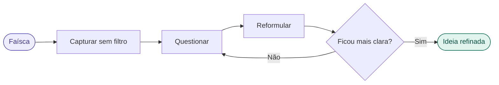

# 01 — Capturar e Refinar a Ideia

tags: #ideação #projeto #início
links: [[02 - Definir o Problema Real]] | [[🗺️ Mapa Principal]]

---

## O problema das ideias brutas

Todo projeto começa com uma faísca — uma observação, uma frustração, uma oportunidade. O erro mais comum é tratar essa faísca como um projeto pronto. Ela não é. Ela é apenas o ponto de partida.

> "Uma ideia não validada é só uma opinião com entusiasmo."

A diferença entre uma ideia que vira projeto e uma que fica no papel está na qualidade das perguntas que você faz **antes** de começar.

---

## O ciclo de refinamento



---

## Passo 1 — Capture sem filtro

Escreva a ideia como ela veio, sem julgamento. Uma frase, um parágrafo, um rascunho — não importa a forma. O objetivo é tirar da cabeça e colocar no papel.

```
Exemplo bruto:
"Queria criar um app que ajuda as pessoas a organizarem suas finanças
porque eu sempre me perco no fim do mês e não sei onde o dinheiro foi."
```

---

## Passo 2 — As 5 perguntas de refinamento

Depois de capturar, responda com honestidade:

### 1. Qual é o problema central?
Separe o **problema** da **solução**. Muitas vezes a ideia já vem como solução — volte um passo atrás.

```
❌ "Quero criar um app de finanças"  → isso é a solução
✅ "Pessoas perdem o controle dos gastos e só percebem no fim do mês" → esse é o problema
```

### 2. Para quem exatamente?
Quanto mais específico o público, mais forte o projeto.

```
❌ "Para todo mundo"
✅ "Para universitários que recebem mesada ou bolsa e nunca aprenderam a gerir dinheiro"
```

### 3. Por que agora?
O que mudou no mundo que torna essa ideia relevante neste momento?

```
Exemplo: "O número de pessoas endividadas entre 18-25 cresceu X% após a pandemia.
Pix e compras por impulso via apps pioraram o controle financeiro dessa faixa."
```

### 4. Por que você?
O que te conecta a esse problema? Experiência própria, conhecimento técnico, acesso a recursos?

```
"Já vivi esse problema. Conheço o público. Tenho habilidade técnica para construir."
```

### 5. O que existe hoje?
Se o problema é real, por que ainda não foi resolvido? O que as soluções atuais erram?

---

## A ideia refinada — formato padrão

Depois das perguntas, reescreva a ideia neste formato:

```
[Nome do projeto] é um(a) [tipo de solução]
para [público específico]
que resolve [problema central]
diferente das alternativas atuais porque [diferencial].
```

**Exemplo:**
```
"FinFácil" é uma ferramenta de controle financeiro
para universitários
que resolve a falta de consciência sobre gastos do dia a dia
diferente das alternativas atuais porque usa categorização automática
por foto do recibo — sem precisar digitar nada manualmente.
```

---

## Erros clássicos nesta fase

| Erro | Consequência | Como evitar |
|---|---|---|
| Ideia vaga demais | Ninguém entende o que é | Use o formato padrão acima |
| Solução antes do problema | Constrói a coisa errada | Sempre comece pelo problema |
| Público genérico demais | Difícil validar e comunicar | Defina 1 persona específica |
| Apaixonar pela ideia antes de validar | Investe tempo em algo sem demanda | Valide antes de construir |
| Guardar a ideia em segredo | Não recebe feedback cedo o suficiente | Compartilhe cedo, feedback é ouro |

---

## Ferramenta — o Post-it de 1 minuto

Se você não consegue explicar a ideia em 1 minuto para um estranho, ela ainda não está refinada o suficiente. Teste com alguém fora do seu contexto — se ela não entender, a ideia precisa de mais trabalho.

---

## Próximas notas
- [[02 - Definir o Problema Real]] — aprofundar no problema antes de qualquer solução
- [[03 - Pesquisa e Benchmark]] — entender o que já existe
