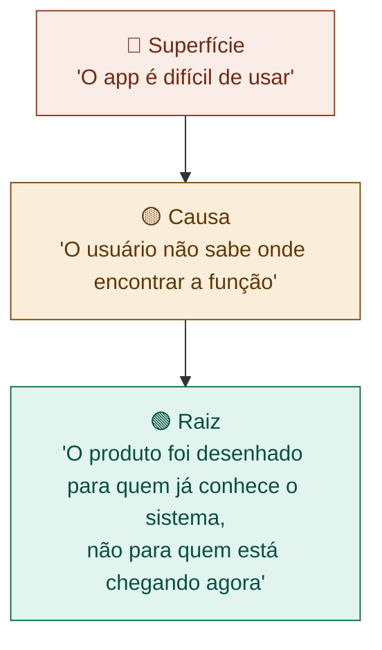

# 02 — Definir o Problema Real

tags: #ideação #problema #projeto
links: [[01 - Capturar e Refinar a Ideia]] | [[03 - Pesquisa e Benchmark]] | [[🗺️ Mapa Principal]]

---

## Por que o problema é mais importante que a solução

A maioria dos projetos fracassa não porque a solução era ruim — mas porque o problema escolhido não era real, urgente ou relevante o suficiente para as pessoas.

> "Se eu tivesse 1 hora para resolver um problema, passaria 55 minutos pensando no problema e 5 minutos na solução."
> — atribuído a Einstein

Um problema bem definido já contém 80% da solução. Um problema mal definido gera projetos que ninguém usa.

---

## Os 3 níveis do problema

Todo problema tem três camadas. Projetos fracos ficam na superfície. Projetos fortes chegam na raiz.



Sempre pergunte "por quê?" pelo menos 3 vezes antes de aceitar que encontrou o problema real. Essa técnica chama-se **5 Porquês**.

---

## Técnica — os 5 Porquês

Pegue o sintoma visível e questione sua causa repetidamente:

```
Sintoma:   "Meus colegas de faculdade nunca fazem o trabalho em grupo a tempo"

Por quê?   "Porque ficam procrastinando as tarefas"
Por quê?   "Porque as tarefas não têm prazo intermediário, só entrega final"
Por quê?   "Porque ninguém define quem faz o quê e quando"
Por quê?   "Porque na reunião inicial ninguém quer ser o chato que cobra"
Por quê?   "Porque não existe uma ferramenta neutra que formalize isso sem conflito pessoal"

Problema real: falta de formalização de responsabilidades em grupos sem hierarquia clara.
Solução possível: ferramenta que distribui tarefas automaticamente e envia lembretes sem que ninguém precise cobrar pessoalmente.
```

---

## O mapa do problema — 4 dimensões

Para cada problema que você identificou, mapeie:

| Dimensão | Pergunta | Exemplo |
|---|---|---|
| **Quem sofre** | Quem sente esse problema na pele? | Alunos de cursos noturnos |
| **Com que frequência** | Isso acontece sempre ou raramente? | Em todo trabalho em grupo |
| **Qual a dor** | O que acontece quando o problema não é resolvido? | Nota baixa, estresse, conflito |
| **Urgência** | As pessoas tentam resolver isso hoje de alguma forma? | Sim — usam grupo de WhatsApp, mas é caótico |

Se a urgência for baixa (as pessoas convivem com o problema sem tentar resolver), reconsidere se vale o investimento.

---

## Tipos de problema — saiba qual é o seu

| Tipo | Descrição | Sinal |
|---|---|---|
| **Dor clara** | Pessoas sabem que têm o problema e o verbalizam | "Odeio fazer X" |
| **Dor latente** | Problema existe mas as pessoas não nomeiam | "É assim mesmo, né?" |
| **Oportunidade** | Não há dor, mas há espaço para melhorar algo | "Seria legal se..." |
| **Problema falso** | Você acha que é problema, mas as pessoas não ligam | Nenhuma reação emocional ao descrever |

Projetos sobre **dor clara** são os mais fáceis de validar e vender. **Dores latentes** são as mais difíceis de comunicar mas às vezes geram os maiores produtos.

---

## Redigindo o enunciado do problema

Um bom enunciado de problema tem:
- Um **sujeito** (quem sofre)
- Uma **situação** (contexto)
- Uma **dificuldade** (o que não funciona)
- Um **impacto** (o que isso causa)

```
Formato:
[Sujeito] que [situação] frequentemente [dificuldade],
o que resulta em [impacto negativo].

Exemplo:
"Estudantes universitários que fazem trabalhos em grupo frequentemente perdem
prazos ou entregam trabalhos incompletos por falta de coordenação interna,
o que resulta em notas baixas, conflitos e estresse desnecessário."
```

---

## Sinais de que você ainda não definiu o problema

- A definição começa com "Quero criar..." ou "Vamos desenvolver..."
- O problema descrito só tem uma solução óbvia
- Você não consegue descrever quem sofre de forma específica
- Quando perguntado, as pessoas não reconhecem o problema como real

---

## Próximas notas
- [[03 - Pesquisa e Benchmark]] — o que já existe para resolver esse problema?
- [[04 - Validação com Pessoas Reais]] — confirmar com o público real
